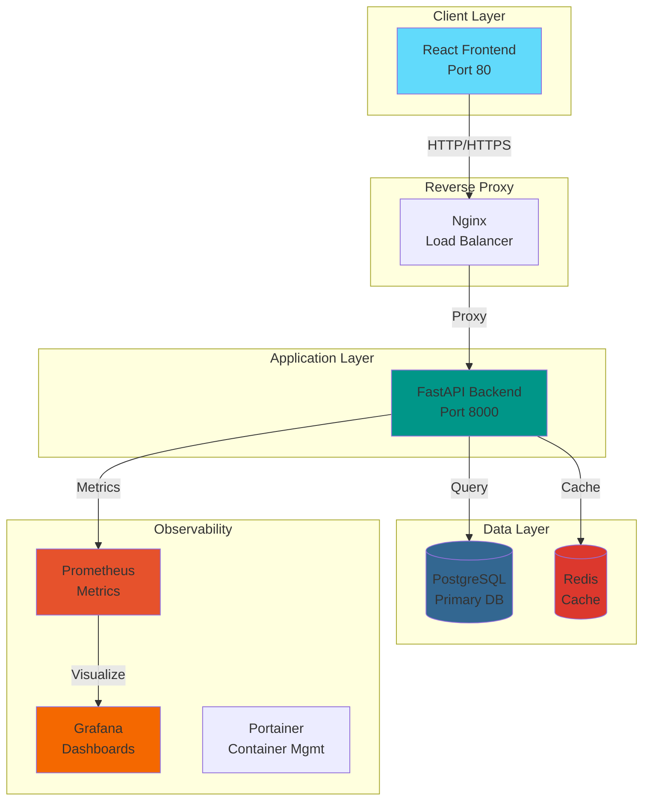

<div align="center">

# 🌟 Synks Application

### Enterprise-Grade Customer Portal Platform

[](https://github.com/username/synks/actions)
[](https://github.com/username/synks/security)
[](https://github.com/username/synks/pkgs/container/synks)
[](LICENSE)

[](https://www.python.org/)
[](https://fastapi.tiangolo.com/)
[](https://reactjs.org/)
[](https://redux-toolkit.js.org/)
[](https://vitejs.dev/)

[](https://sonarcloud.io/dashboard?id=synks)
[](https://codecov.io/gh/username/synks)
[](https://status.synks.app)

[🚀 Quick Start](#-quick-start) •
[📖 Documentation](#-documentation) •
[🏗️ Architecture](#️-architecture) •
[🔧 Development](#-development) •
[🐳 Docker](#-docker) •
[📊 Monitoring](#-monitoring)

</div>

---

## ✨ Features

<div align="center">

| Feature | Description | Status |
|---------|-------------|--------|
| 🔐 **Authentication** | JWT-based secure authentication | ✅ Production |
| 📊 **Dashboard** | Real-time analytics and metrics | ✅ Production |
| 🎯 **Category Management** | Dynamic content categorization | ✅ Production |
| 🔄 **Real-time Updates** | WebSocket-powered live data | ✅ Production |
| 📱 **Responsive Design** | Mobile-first UI/UX | ✅ Production |
| 🌐 **RESTful API** | Comprehensive REST endpoints | ✅ Production |
| 🔍 **Search & Filter** | Advanced data filtering | ✅ Production |
| 📈 **Analytics** | Built-in usage analytics | ✅ Production |
| 🎨 **Customizable Theme** | Light/Dark mode support | 🚧 Beta |
| 🌍 **Internationalization** | Multi-language support | 📅 Planned |

</div>

---

## 🎯 Tech Stack

### Backend
```
🐍 FastAPI          Modern Python web framework
🗄️  PostgreSQL      Primary database (production-ready)
📦 Redis           Caching & session management
🔒 JWT             Secure authentication
📊 Prometheus      Metrics collection
🐳 Docker          Containerization
```

### Frontend
```
⚛️  React 18        UI framework with hooks
🎨 Tailwind CSS    Utility-first styling
📦 Redux Toolkit   State management
📊 Recharts        Data visualization
⚡ Vite            Lightning-fast build tool
🔄 Axios           HTTP client
```

### DevOps & Infrastructure
```
🤖 GitHub Actions  CI/CD automation
🐳 Docker Compose  Multi-container orchestration
📈 Grafana         Metrics visualization
🔍 Jaeger          Distributed tracing (planned)
🛡️  CodeQL          Security scanning
🔐 Trivy           Vulnerability scanning
```

---

## 🚀 Quick Start

### Prerequisites

- **Docker** 24.0+ & **Docker Compose** 2.20+
- **Node.js** 18+ & **npm** 9+ (for local development)
- **Python** 3.11+ (for local development)
- **Make** (optional, for convenience commands)

### 🐳 Docker Quick Start (Recommended)

```bash
# Clone the repository
git clone https://github.com/username/synks.git
cd synks

# Copy environment file
cp .env.example .env

# Start all services
make up
# or: docker-compose up -d

# View logs
make logs
# or: docker-compose logs -f

# Access the application
# Frontend: http://localhost:80
# Backend API: http://localhost:8000
# API Docs: http://localhost:8000/docs
# Portainer: http://localhost:9000
# Grafana: http://localhost:3001
```

### 💻 Local Development

```bash
# Backend setup
cd backend
python -m venv venv
source venv/bin/activate  # Windows: venv\Scripts\activate
pip install -r requirements.txt
uvicorn main:app --reload --port 8000

# Frontend setup (new terminal)
cd frontend
npm install
npm run dev
```

---

## 📖 Documentation

Comprehensive guides for different aspects of the project:

| Document | Description | Audience |
|----------|-------------|----------|
| [🏗️ Architecture Guide](docs/ARCHITECTURE.md) | System design, patterns, and technical decisions | Engineers |
| [🚀 Deployment Guide](docs/DEPLOYMENT.md) | Production deployment strategies | DevOps |
| [🔧 Development Guide](docs/DEVELOPMENT.md) | Setup, workflows, and best practices | Developers |
| [🐳 Docker Guide](docs/DOCKER.md) | Container architecture and orchestration | DevOps |
| [🔄 CI/CD Guide](docs/CICD.md) | Pipeline automation and workflows | DevOps |
| [📊 Monitoring Guide](docs/MONITORING.md) | Observability and alerting | SRE/DevOps |
| [🔒 Security Guide](docs/SECURITY.md) | Security practices and compliance | Security |
| [📚 API Documentation](http://localhost:8000/docs) | Interactive API reference | Developers |

---

## 🏗️ Architecture

<div align="center">



</div>

### Key Design Principles

- **🎯 Clean Architecture** - Separation of concerns with clear boundaries
- **🔄 Async/Await** - Non-blocking I/O for high performance
- **📦 Containerization** - Consistent environments across dev/staging/prod
- **🔒 Security First** - JWT auth, CORS, input validation, security headers
- **📊 Observable** - Comprehensive logging, metrics, and tracing
- **⚡ Performance** - Redis caching, connection pooling, optimized queries
- **🧪 Testable** - Unit, integration, and E2E test coverage
- **📈 Scalable** - Horizontal scaling with load balancing

---

## 🔧 Development

### Project Structure

```
synks/
├── backend/                 # FastAPI backend
│   ├── main.py             # Application entry point
│   ├── config.py           # Configuration management
│   ├── models/             # Database models
│   ├── schemas/            # Pydantic schemas
│   ├── routers/            # API endpoints
│   ├── services/           # Business logic
│   ├── middleware/         # Custom middleware
│   └── tests/              # Backend tests
│
├── frontend/               # React frontend
│   ├── src/
│   │   ├── components/     # React components
│   │   ├── pages/          # Page components
│   │   ├── store/          # Redux store
│   │   ├── services/       # API services
│   │   ├── hooks/          # Custom hooks
│   │   └── utils/          # Utility functions
│   └── tests/              # Frontend tests
│
├── .github/                # GitHub Actions workflows
│   ├── workflows/          # CI/CD pipelines
│   └── ISSUE_TEMPLATE/     # Issue templates
│
├── docs/                   # Documentation
├── docker-compose.yml      # Docker orchestration
├── Makefile               # Development commands
└── .env.example           # Environment template
```

### Available Make Commands

```bash
# Docker Operations
make up              # Start all services
make down            # Stop all services
make restart         # Restart all services
make logs            # View logs
make clean           # Clean up volumes and networks

# Development
make install-backend     # Install backend dependencies
make install-frontend    # Install frontend dependencies
make dev-backend         # Run backend in dev mode
make dev-frontend        # Run frontend in dev mode

# Testing
make test-backend        # Run backend tests
make test-frontend       # Run frontend tests
make test-all           # Run all tests
make coverage           # Generate coverage report

# Code Quality
make lint-backend       # Lint backend code
make lint-frontend      # Lint frontend code
make format-backend     # Format backend code
make format-frontend    # Format frontend code

# CI/CD
make commit            # Create conventional commit
make release           # Create new release
make security-scan     # Run security scan

# Database
make db-migrate        # Run migrations
make db-seed           # Seed database
make db-backup         # Backup database
```

### Conventional Commits

This project follows [Conventional Commits](https://www.conventionalcommits.org/):

```bash
feat(auth): add OAuth2 login support
fix(dashboard): resolve data loading issue
docs(readme): update installation instructions
refactor(api): simplify error handling
perf(cache): improve Redis connection pooling
test(auth): add unit tests for login endpoint
```

Use `make commit` for interactive commit creation with validation.

---

## 🐳 Docker

### Services

| Service | Port | Description |
|---------|------|-------------|
| **Frontend** | 80 | React application (Nginx) |
| **Backend** | 8000 | FastAPI application |
| **PostgreSQL** | 5432 | Primary database |
| **Redis** | 6379 | Cache & sessions |
| **Nginx Proxy** | 80/443 | Reverse proxy & load balancer |
| **Prometheus** | 9090 | Metrics collection |
| **Grafana** | 3001 | Metrics visualization |
| **Portainer** | 9000 | Container management UI |

### Environment Variables

```bash
# Application
APP_NAME=Synks
APP_VERSION=1.0.0
ENVIRONMENT=production

# Backend
BACKEND_PORT=8000
SECRET_KEY=your-secret-key-here
DEBUG=false

# Database
POSTGRES_USER=synks
POSTGRES_PASSWORD=secure-password
POSTGRES_DB=synks_db

# Redis
REDIS_HOST=redis
REDIS_PORT=6379

# Monitoring
GRAFANA_ADMIN_PASSWORD=admin
PROMETHEUS_PORT=9090
```

See [`.env.example`](.env.example) for complete list.

---

## 📊 Monitoring

### Metrics & Dashboards

- **Grafana Dashboards**: http://localhost:3001 (admin/admin)
  - Application performance metrics
  - Database query analytics
  - Cache hit rates
  - API response times
  - Error rates and alerts

- **Prometheus**: http://localhost:9090
  - Raw metrics data
  - Custom queries (PromQL)
  - Service discovery

- **Portainer**: http://localhost:9000
  - Container health monitoring
  - Resource usage (CPU, RAM, Network)
  - Log aggregation
  - Stack management

### Health Checks

```bash
# Application health
curl http://localhost:8000/health

# Detailed readiness check
curl http://localhost:8000/health/ready

# Prometheus metrics
curl http://localhost:8000/metrics
```

---

## 🧪 Testing

### Test Coverage

- **Backend**: 85%+ coverage (pytest)
- **Frontend**: 80%+ coverage (Vitest + React Testing Library)
- **E2E**: Critical user flows (Playwright - planned)

```bash
# Run all tests with coverage
make test-all

# Backend tests only
make test-backend

# Frontend tests only
make test-frontend

# Watch mode (development)
cd backend && pytest --watch
cd frontend && npm run test:watch
```

---

## 🚀 Deployment

### Production Checklist

- [ ] Environment variables configured
- [ ] Database migrations applied
- [ ] SSL certificates installed
- [ ] Backup strategy implemented
- [ ] Monitoring & alerting configured
- [ ] Security scan passed
- [ ] Load testing completed
- [ ] Documentation updated

### CI/CD Pipeline

Automated deployment on:
- **Staging**: Push to `develop` branch
- **Production**: Push to `main` branch or create release tag

```bash
# Create a new release
git tag v1.2.3
git push origin v1.2.3

# Or use the helper
make release
```

See [CI/CD Guide](docs/CICD.md) for details.

---

## 🤝 Contributing

We welcome contributions! Please see our [Contributing Guide](CONTRIBUTING.md) for details.

### Development Workflow

1. **Fork** the repository
2. **Create** a feature branch (`git checkout -b feat/amazing-feature`)
3. **Commit** using conventional commits (`make commit`)
4. **Push** to your branch (`git push origin feat/amazing-feature`)
5. **Open** a Pull Request

### Code Review Process

- All PRs require at least 1 approval
- CI/CD checks must pass
- Code coverage must not decrease
- Documentation must be updated

---

## 📄 License

This project is licensed under the MIT License - see the [LICENSE](LICENSE) file for details.

---

## 🙏 Acknowledgments

- **FastAPI** - Modern Python web framework
- **React** - UI component library
- **Docker** - Containerization platform
- **GitHub Actions** - CI/CD automation
- **Prometheus & Grafana** - Monitoring stack

---

## 📞 Support

- 📧 **Email**: support@synks.app
- 💬 **Discord**: [Join our community](https://discord.gg/synks)
- 🐛 **Issues**: [GitHub Issues](https://github.com/username/synks/issues)
- 📖 **Wiki**: [Documentation](https://docs.synks.app)

---

<div align="center">

**Made with ❤️ by the Synks Team**

⭐ **Star us on GitHub** if you find this project useful!

[](https://github.com/username/synks/stargazers)
[](https://github.com/username/synks/network/members)
[](https://github.com/username/synks/watchers)

</div>
