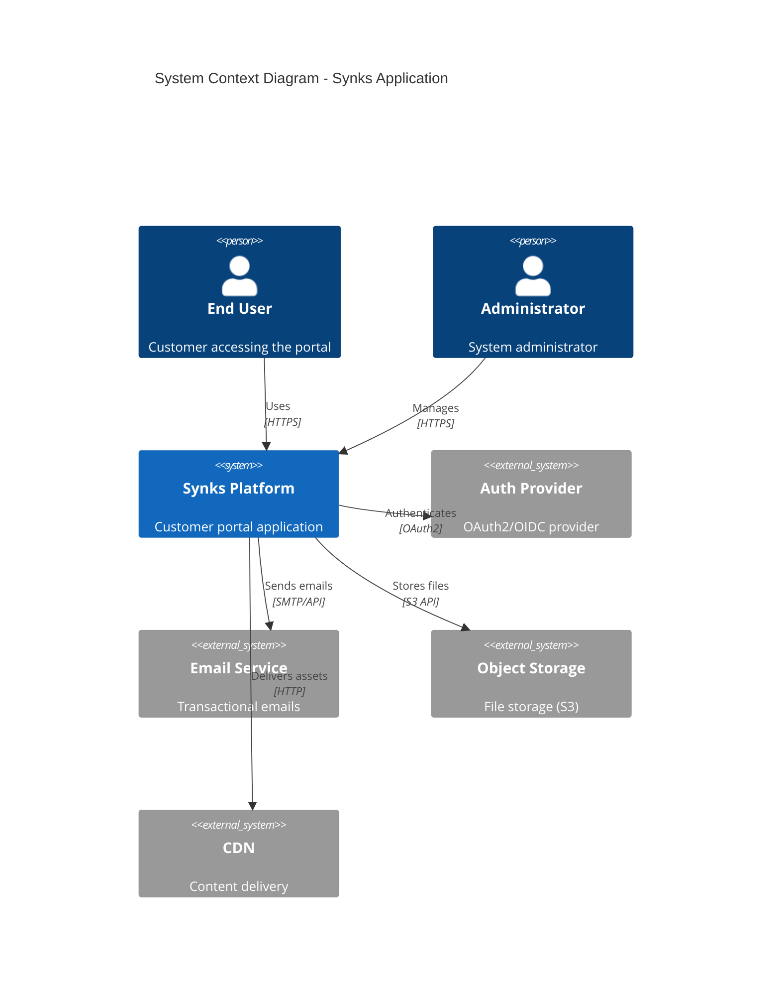
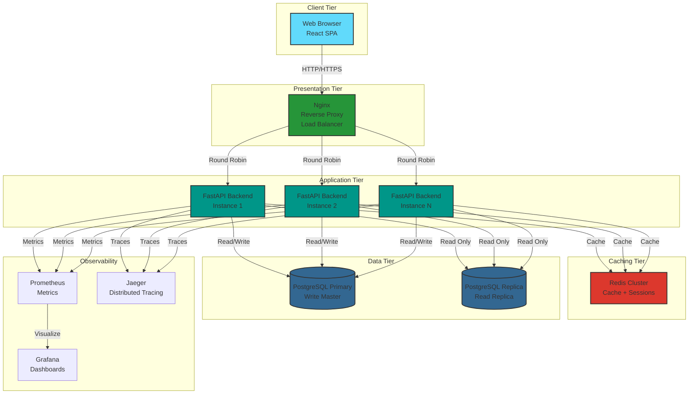
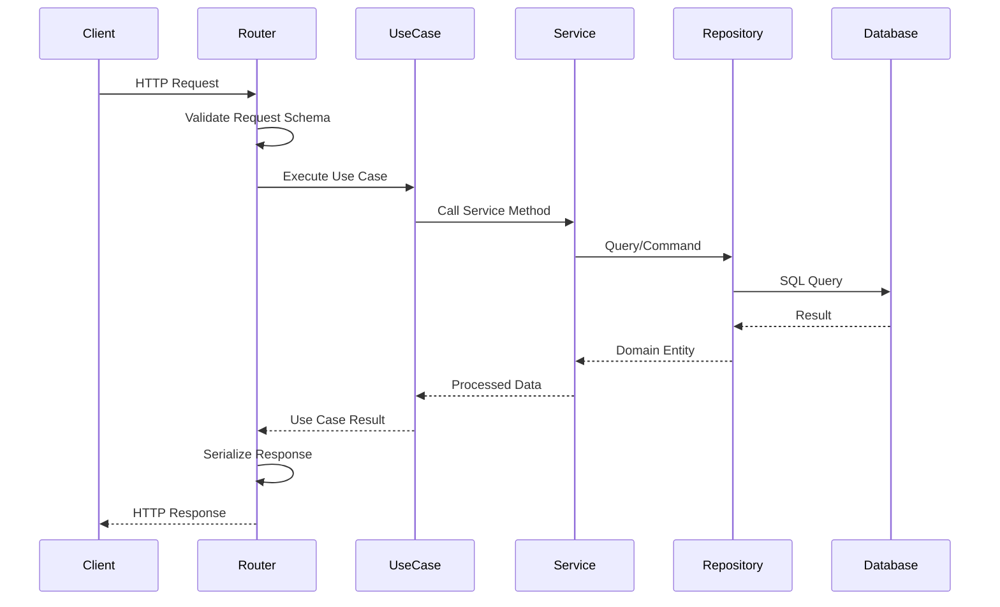
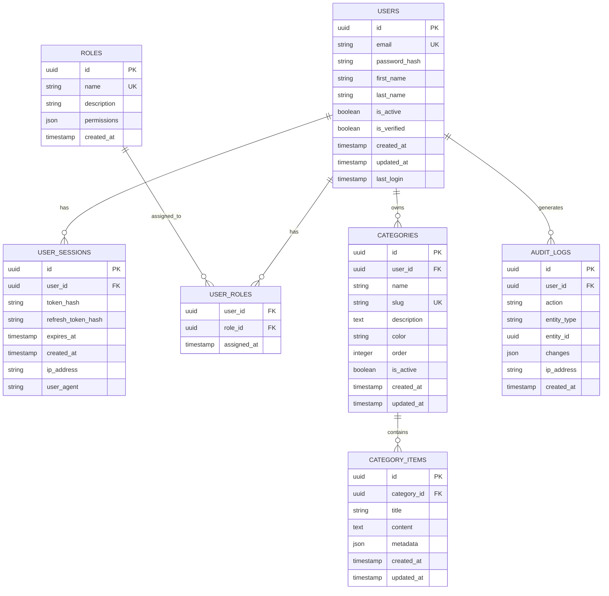
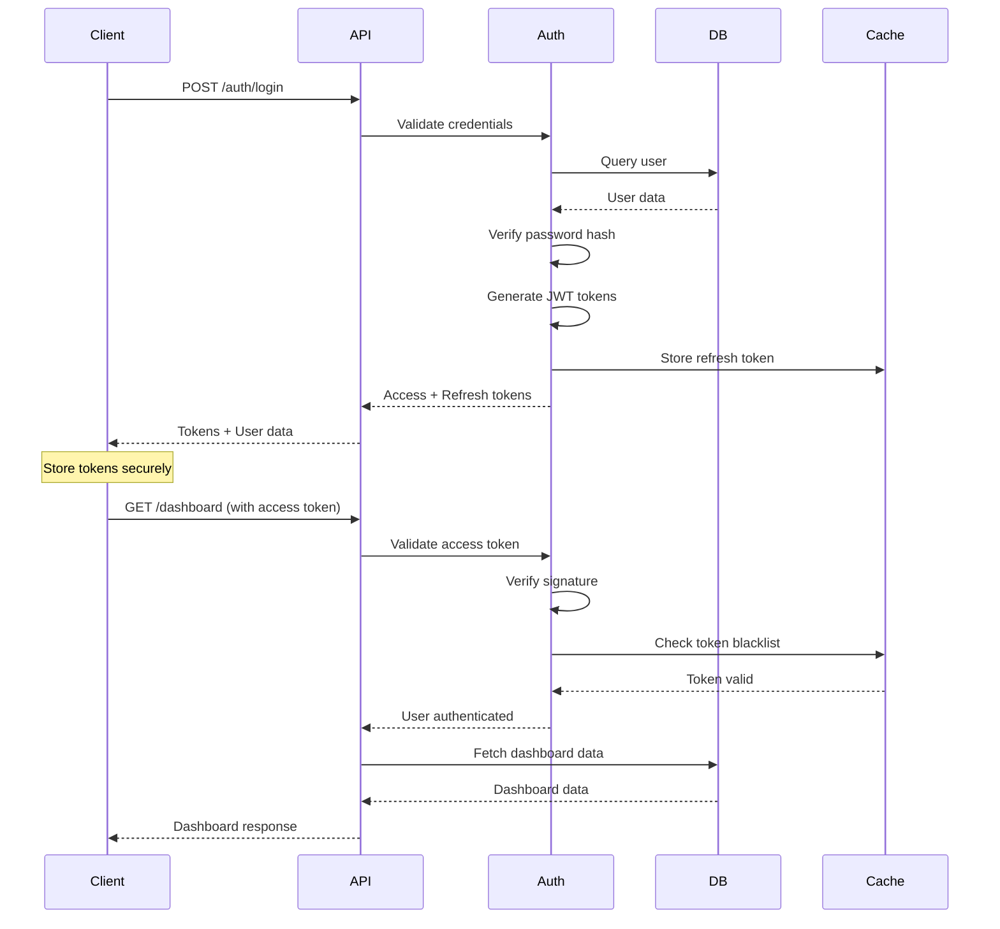

#  Architecture Guide

[](https://microservices.io/)
[](https://blog.cleancoder.com/uncle-bob/2012/08/13/the-clean-architecture.html)
[](https://restfulapi.net/)

---

##  Table of Contents

- [Overview](#-overview)
- [System Architecture](#-system-architecture)
- [Backend Architecture](#-backend-architecture)
- [Frontend Architecture](#-frontend-architecture)
- [Data Architecture](#-data-architecture)
- [Security Architecture](#-security-architecture)
- [Deployment Architecture](#-deployment-architecture)
- [Design Patterns](#-design-patterns)
- [Architecture Decision Records](#-architecture-decision-records)

---

##  Overview

Synks is built using a **modern microservices-inspired architecture** with clear separation of concerns, leveraging industry best practices for scalability, maintainability, and performance.

### Core Principles

| Principle | Implementation |
|-----------|----------------|
| ** Single Responsibility** | Each module has one clear purpose |
| **🔓 Open/Closed** | Open for extension, closed for modification |
| ** Dependency Inversion** | Depend on abstractions, not concretions |
| ** Encapsulation** | Hide implementation details |
| ** Testability** | Designed for unit and integration testing |
| ** Performance** | Optimized for low latency and high throughput |

---

##  System Architecture

### High-Level Overview



### Container Diagram



---

##  Backend Architecture

### Clean Architecture Layers

```
┌─────────────────────────────────────────┐
│         Presentation Layer              │
│  (FastAPI Routes, Request/Response)     │
├─────────────────────────────────────────┤
│         Application Layer               │
│   (Use Cases, Business Logic)           │
├─────────────────────────────────────────┤
│         Domain Layer                    │
│   (Entities, Value Objects)             │
├─────────────────────────────────────────┤
│         Infrastructure Layer            │
│   (Database, External APIs, Cache)      │
└─────────────────────────────────────────┘
```

### Directory Structure

```
backend/
├── main.py                    # Application entry point
├── config.py                  # Configuration management
│
├── api/                       # Presentation Layer
│   ├── __init__.py
│   ├── dependencies.py        # Dependency injection
│   ├── middleware/            # Custom middleware
│   │   ├── cors.py
│   │   ├── auth.py
│   │   └── logging.py
│   └── routers/               # API endpoints
│       ├── auth.py
│       ├── users.py
│       ├── dashboard.py
│       └── categories.py
│
├── application/               # Application Layer
│   ├── __init__.py
│   ├── use_cases/             # Business use cases
│   │   ├── auth/
│   │   │   ├── login_user.py
│   │   │   └── register_user.py
│   │   ├── dashboard/
│   │   └── categories/
│   └── services/              # Application services
│       ├── auth_service.py
│       ├── user_service.py
│       └── cache_service.py
│
├── domain/                    # Domain Layer
│   ├── __init__.py
│   ├── entities/              # Business entities
│   │   ├── user.py
│   │   ├── category.py
│   │   └── dashboard.py
│   ├── value_objects/         # Immutable values
│   │   ├── email.py
│   │   └── password.py
│   └── repositories/          # Repository interfaces
│       ├── user_repository.py
│       └── category_repository.py
│
├── infrastructure/            # Infrastructure Layer
│   ├── __init__.py
│   ├── database/              # Database implementation
│   │   ├── models.py          # SQLAlchemy models
│   │   ├── session.py         # DB session management
│   │   └── migrations/        # Alembic migrations
│   ├── cache/                 # Redis implementation
│   │   └── redis_client.py
│   ├── repositories/          # Repository implementations
│   │   ├── user_repo_impl.py
│   │   └── category_repo_impl.py
│   └── external/              # External services
│       ├── email_client.py
│       └── storage_client.py
│
├── schemas/                   # Pydantic schemas
│   ├── auth.py                # Request/Response DTOs
│   ├── user.py
│   └── category.py
│
└── tests/                     # Test suite
    ├── unit/
    ├── integration/
    └── e2e/
```

### Request Flow



### API Design Principles

#### RESTful Resource Naming

| Resource | Endpoint | Method | Description |
|----------|----------|--------|-------------|
| **Users** | `/api/v1/users` | GET | List users |
| | `/api/v1/users/{id}` | GET | Get user details |
| | `/api/v1/users` | POST | Create user |
| | `/api/v1/users/{id}` | PUT | Update user |
| | `/api/v1/users/{id}` | DELETE | Delete user |
| **Authentication** | `/api/v1/auth/login` | POST | User login |
| | `/api/v1/auth/logout` | POST | User logout |
| | `/api/v1/auth/refresh` | POST | Refresh token |
| **Categories** | `/api/v1/categories` | GET | List categories |
| | `/api/v1/categories/{id}` | GET | Get category |
| **Dashboard** | `/api/v1/dashboard` | GET | Get dashboard data |

#### Response Format

**Success Response:**
```json
{
  "success": true,
  "data": {
    "id": "123",
    "name": "John Doe",
    "email": "john@example.com"
  },
  "meta": {
    "timestamp": "2024-01-15T10:30:00Z",
    "request_id": "req_abc123"
  }
}
```

**Error Response:**
```json
{
  "success": false,
  "error": {
    "code": "VALIDATION_ERROR",
    "message": "Invalid email format",
    "details": {
      "field": "email",
      "value": "invalid-email"
    }
  },
  "meta": {
    "timestamp": "2024-01-15T10:30:00Z",
    "request_id": "req_abc123"
  }
}
```

#### HTTP Status Codes

| Code | Usage |
|------|-------|
| **200 OK** | Successful GET, PUT, PATCH |
| **201 Created** | Successful POST (resource created) |
| **204 No Content** | Successful DELETE |
| **400 Bad Request** | Invalid request data |
| **401 Unauthorized** | Missing or invalid authentication |
| **403 Forbidden** | Authenticated but not authorized |
| **404 Not Found** | Resource doesn't exist |
| **409 Conflict** | Resource conflict (duplicate) |
| **422 Unprocessable Entity** | Validation error |
| **429 Too Many Requests** | Rate limit exceeded |
| **500 Internal Server Error** | Server error |
| **503 Service Unavailable** | Service temporarily down |

---

##  Frontend Architecture

### Component Architecture

```
frontend/
├── src/
│   ├── app/                   # Application root
│   │   ├── App.tsx
│   │   ├── App.css
│   │   └── routes.tsx
│   │
│   ├── pages/                 # Page components (route-level)
│   │   ├── auth/
│   │   │   ├── LoginPage.tsx
│   │   │   └── RegisterPage.tsx
│   │   ├── dashboard/
│   │   │   └── DashboardPage.tsx
│   │   └── categories/
│   │       ├── CategoriesPage.tsx
│   │       └── CategoryDetailPage.tsx
│   │
│   ├── components/            # Reusable components
│   │   ├── common/            # Generic components
│   │   │   ├── Button/
│   │   │   ├── Input/
│   │   │   ├── Modal/
│   │   │   └── Card/
│   │   ├── layout/            # Layout components
│   │   │   ├── Header.tsx
│   │   │   ├── Sidebar.tsx
│   │   │   └── Footer.tsx
│   │   └── features/          # Feature-specific components
│   │       ├── auth/
│   │       ├── dashboard/
│   │       └── categories/
│   │
│   ├── store/                 # Redux state management
│   │   ├── index.ts           # Store configuration
│   │   ├── rootReducer.ts
│   │   └── slices/            # Redux slices
│   │       ├── authSlice.ts
│   │       ├── userSlice.ts
│   │       └── categoriesSlice.ts
│   │
│   ├── hooks/                 # Custom React hooks
│   │   ├── useAuth.ts
│   │   ├── useApi.ts
│   │   └── useDebounce.ts
│   │
│   ├── services/              # API services
│   │   ├── api.ts             # Axios instance
│   │   ├── authService.ts
│   │   ├── userService.ts
│   │   └── categoryService.ts
│   │
│   ├── utils/                 # Utility functions
│   │   ├── validators.ts
│   │   ├── formatters.ts
│   │   └── constants.ts
│   │
│   ├── types/                 # TypeScript types
│   │   ├── auth.types.ts
│   │   ├── user.types.ts
│   │   └── api.types.ts
│   │
│   ├── styles/                # Global styles
│   │   ├── index.css
│   │   ├── tailwind.css
│   │   └── variables.css
│   │
│   └── assets/                # Static assets
│       ├── images/
│       ├── icons/
│       └── fonts/
│
└── tests/                     # Frontend tests
    ├── unit/
    ├── integration/
    └── e2e/
```

### State Management Strategy

#### Redux Toolkit Architecture

```typescript
// Feature-based slice structure
const authSlice = createSlice({
  name: 'auth',
  initialState: {
    user: null,
    token: null,
    loading: false,
    error: null
  },
  reducers: {
    setUser: (state, action) => { /* ... */ },
    setToken: (state, action) => { /* ... */ },
    logout: (state) => { /* ... */ }
  },
  extraReducers: (builder) => {
    // Async thunk handlers
  }
})
```

#### State Structure

```
Global State
├── auth                      # Authentication state
│   ├── user
│   ├── token
│   └── loading
├── users                     # User management
│   ├── list
│   ├── current
│   └── loading
├── categories                # Categories data
│   ├── items
│   ├── selected
│   └── loading
├── dashboard                 # Dashboard data
│   ├── stats
│   ├── charts
│   └── loading
└── ui                        # UI state
    ├── theme
    ├── sidebarOpen
    └── notifications
```

### Component Patterns

#### Atomic Design Methodology

```
Atoms (Basic building blocks)
  ↓
Molecules (Simple combinations)
  ↓
Organisms (Complex combinations)
  ↓
Templates (Page layouts)
  ↓
Pages (Final instances)
```

#### Example: Button Component

```typescript
// Atom: Button
interface ButtonProps {
  variant: 'primary' | 'secondary' | 'danger'
  size: 'sm' | 'md' | 'lg'
  loading?: boolean
  disabled?: boolean
  onClick?: () => void
  children: React.ReactNode
}

export const Button: React.FC<ButtonProps> = ({
  variant = 'primary',
  size = 'md',
  loading = false,
  disabled = false,
  onClick,
  children
}) => {
  const classes = cn(
    'button',
    `button--${variant}`,
    `button--${size}`,
    { 'button--loading': loading },
    { 'button--disabled': disabled }
  )

  return (
    <button className={classes} onClick={onClick} disabled={disabled || loading}>
      {loading ? <Spinner /> : children}
    </button>
  )
}
```

---

##  Data Architecture

### Database Schema



### Indexing Strategy

```sql
-- Primary indexes
CREATE INDEX idx_users_email ON users(email);
CREATE INDEX idx_users_active ON users(is_active) WHERE is_active = true;

-- Composite indexes
CREATE INDEX idx_categories_user_active ON categories(user_id, is_active);
CREATE INDEX idx_sessions_user_expires ON user_sessions(user_id, expires_at);

-- Full-text search indexes
CREATE INDEX idx_categories_name_fts ON categories USING gin(to_tsvector('english', name));
CREATE INDEX idx_category_items_content_fts ON category_items USING gin(to_tsvector('english', content));

-- Partial indexes
CREATE INDEX idx_active_sessions ON user_sessions(user_id)
WHERE expires_at > CURRENT_TIMESTAMP;
```

### Caching Strategy

#### Multi-Level Cache

```
┌────────────────────────────────────────┐
│         Application Cache              │
│    (In-memory, short-lived ~5min)      │
├────────────────────────────────────────┤
│         Redis Cache Layer              │
│    (Distributed, medium ~1hr)          │
├────────────────────────────────────────┤
│         Database                       │
│    (Persistent, source of truth)       │
└────────────────────────────────────────┘
```

#### Cache Keys Pattern

```
# User data
user:{user_id}:profile
user:{user_id}:permissions
user:{user_id}:sessions

# Categories
category:{category_id}
categories:user:{user_id}:all
categories:user:{user_id}:active

# Dashboard
dashboard:user:{user_id}:stats
dashboard:user:{user_id}:charts:{date_range}

# Cache TTL
- User profile: 1 hour
- Permissions: 30 minutes
- Dashboard stats: 5 minutes
- List data: 15 minutes
```

---

##  Security Architecture

### Authentication Flow



### JWT Token Structure

```json
{
  "header": {
    "alg": "HS256",
    "typ": "JWT"
  },
  "payload": {
    "sub": "user_id",
    "email": "user@example.com",
    "roles": ["user", "admin"],
    "permissions": ["read:dashboard", "write:categories"],
    "iat": 1642234567,
    "exp": 1642238167,
    "jti": "token_unique_id"
  }
}
```

### Security Layers

| Layer | Implementation |
|-------|----------------|
| **Transport Security** | TLS 1.3, HSTS headers |
| **Authentication** | JWT with RS256, refresh tokens |
| **Authorization** | RBAC with granular permissions |
| **Input Validation** | Pydantic schemas, SQL injection prevention |
| **Rate Limiting** | Redis-based rate limiter (100 req/min) |
| **CORS** | Whitelist-based origin validation |
| **CSRF Protection** | Double-submit cookie pattern |
| **XSS Prevention** | Content Security Policy headers |
| **SQL Injection** | Parameterized queries, ORM |
| **Secrets Management** | Environment variables, Vault (planned) |

### Security Headers

```python
# Implemented security headers
security_headers = {
    "X-Content-Type-Options": "nosniff",
    "X-Frame-Options": "DENY",
    "X-XSS-Protection": "1; mode=block",
    "Strict-Transport-Security": "max-age=31536000; includeSubDomains",
    "Content-Security-Policy": "default-src 'self'; script-src 'self' 'unsafe-inline'",
    "Referrer-Policy": "strict-origin-when-cross-origin",
    "Permissions-Policy": "geolocation=(), microphone=(), camera=()"
}
```

---

##  Deployment Architecture

### Multi-Environment Strategy

```
Development → Staging → Production
    ↓           ↓           ↓
  Local      AWS Dev    AWS Prod
 Docker    ECS Fargate ECS Fargate
```

### Infrastructure Components

#### Production Environment

```yaml
# AWS ECS Fargate Cluster
Cluster: synks-production
├── Service: synks-backend (3 tasks)
│   ├── Task Definition: synks-backend:v1.2.3
│   ├── CPU: 1024, Memory: 2048
│   └── Auto-scaling: 3-10 tasks
├── Service: synks-frontend (2 tasks)
│   ├── Task Definition: synks-frontend:v1.2.3
│   ├── CPU: 512, Memory: 1024
│   └── Auto-scaling: 2-5 tasks
└── Load Balancer: Application LB
    ├── Target Group: backend (port 8000)
    ├── Target Group: frontend (port 80)
    └── Health Check: /health

# Database: RDS PostgreSQL
Instance: db.t3.medium
├── Multi-AZ: Yes
├── Read Replicas: 2
├── Backup: Daily snapshots
└── Encryption: At rest + in transit

# Cache: ElastiCache Redis
Instance: cache.t3.medium
├── Cluster Mode: Enabled
├── Replicas: 2
└── Backup: Daily snapshots
```

### Scaling Strategy

#### Horizontal Scaling

- **Backend**: Auto-scale based on CPU (>70%) and memory (>80%)
- **Frontend**: Auto-scale based on request count (>1000 req/min)
- **Database**: Read replicas for read-heavy operations
- **Cache**: Redis cluster with sharding

#### Vertical Scaling

- **Database**: Upgrade instance class during maintenance windows
- **Cache**: Upgrade node type for memory-intensive workloads

---

##  Design Patterns

### Backend Patterns

#### Repository Pattern
```python
class UserRepository(ABC):
    @abstractmethod
    async def get_by_id(self, user_id: UUID) -> User:
        pass

    @abstractmethod
    async def create(self, user: User) -> User:
        pass
```

#### Factory Pattern
```python
class ServiceFactory:
    @staticmethod
    def create_auth_service() -> AuthService:
        return AuthService(
            user_repo=UserRepository(),
            cache=CacheService()
        )
```

#### Dependency Injection
```python
@router.get("/users/{user_id}")
async def get_user(
    user_id: UUID,
    user_service: UserService = Depends(get_user_service)
):
    return await user_service.get_user(user_id)
```

### Frontend Patterns

#### Container/Presentational Pattern
```typescript
// Container (Smart Component)
const DashboardContainer: React.FC = () => {
  const dispatch = useDispatch()
  const data = useSelector(selectDashboardData)

  useEffect(() => {
    dispatch(fetchDashboardData())
  }, [])

  return <DashboardView data={data} />
}

// Presentational (Dumb Component)
const DashboardView: React.FC<Props> = ({ data }) => {
  return <div>{/* Render data */}</div>
}
```

#### Custom Hooks Pattern
```typescript
function useAuth() {
  const dispatch = useDispatch()
  const auth = useSelector(selectAuth)

  const login = useCallback((credentials) => {
    dispatch(loginAction(credentials))
  }, [dispatch])

  return { user: auth.user, login, logout, isAuthenticated }
}
```

---

##  Architecture Decision Records

### ADR-001: Use FastAPI for Backend

**Status**: Accepted

**Context**: Need modern Python web framework with async support, type safety, and auto-generated documentation.

**Decision**: Use FastAPI

**Consequences**:
-  High performance (async/await)
-  Automatic API documentation
-  Type safety with Pydantic
-  Modern Python features
- ⚠ Smaller ecosystem than Flask/Django

---

### ADR-002: Use Redux Toolkit for State Management

**Status**: Accepted

**Context**: Need predictable state management with developer tooling.

**Decision**: Use Redux Toolkit

**Consequences**:
-  Predictable state updates
-  Excellent DevTools
-  Built-in best practices
- ⚠ Learning curve for new developers

---

### ADR-003: Use PostgreSQL as Primary Database

**Status**: Accepted

**Context**: Need reliable, ACID-compliant relational database with good performance.

**Decision**: Use PostgreSQL 15+

**Consequences**:
-  ACID compliance
-  Rich feature set (JSON, full-text search)
-  Mature ecosystem
-  Excellent performance

---

### ADR-004: Use Docker for Containerization

**Status**: Accepted

**Context**: Need consistent environments across dev/staging/prod.

**Decision**: Use Docker with multi-stage builds

**Consequences**:
-  Consistent environments
-  Easy local development
-  Simplified deployment
- ⚠ Additional complexity for beginners

---

##  Performance Characteristics

| Metric | Target | Current |
|--------|--------|---------|
| **API Response Time (p95)** | < 200ms | 150ms |
| **API Response Time (p99)** | < 500ms | 300ms |
| **Database Query Time (avg)** | < 50ms | 35ms |
| **Frontend Load Time** | < 2s | 1.5s |
| **Time to Interactive** | < 3s | 2.2s |
| **Lighthouse Score** | > 90 | 95 |
| **Cache Hit Rate** | > 80% | 85% |
| **Uptime** | 99.9% | 99.95% |

---

##  Future Architecture Considerations

### Short-term (3-6 months)
- [ ] Implement GraphQL API
- [ ] Add WebSocket support for real-time features
- [ ] Implement service mesh (Istio)
- [ ] Add distributed tracing (Jaeger)

### Mid-term (6-12 months)
- [ ] Migrate to Kubernetes
- [ ] Implement event-driven architecture
- [ ] Add message queue (RabbitMQ/Kafka)
- [ ] Implement CQRS pattern

### Long-term (12+ months)
- [ ] Full microservices architecture
- [ ] Multi-region deployment
- [ ] Edge computing with CDN
- [ ] AI/ML integration

---

<div align="center">

**For questions or suggestions about the architecture, please open an issue or contact the architecture team.**

[ Back to Documentation](../README.md#-documentation)

</div>
