# 🔄 CI/CD Guide

[](https://github.com/features/actions)
[](https://github.com/username/synks/actions)
[](https://github.com/username/synks)

---

## 📋 Table of Contents

- [Overview](#-overview)
- [Pipeline Architecture](#-pipeline-architecture)
- [Workflows](#-workflows)
- [Conventional Commits](#-conventional-commits)
- [Semantic Versioning](#-semantic-versioning)
- [Deployment Strategy](#-deployment-strategy)
- [Monitoring & Alerts](#-monitoring--alerts)
- [Best Practices](#-best-practices)

---

## 🎯 Overview

Our CI/CD pipeline provides **fully automated** testing, security scanning, building, and deployment using GitHub Actions.

### Key Features

| Feature | Description | Status |
|---------|-------------|--------|
| **🧪 Automated Testing** | Unit, integration, E2E tests | ✅ Active |
| **🔒 Security Scanning** | CodeQL, Trivy, Dependency Review | ✅ Active |
| **📦 Docker Builds** | Multi-platform image building | ✅ Active |
| **🚀 Auto Deployment** | Staging & production deploys | ✅ Active |
| **📊 Code Quality** | Linting, formatting, type checking | ✅ Active |
| **🏷️ Auto Labeling** | PR categorization & sizing | ✅ Active |
| **📝 Changelog Generation** | Automatic release notes | ✅ Active |
| **🤖 Dependency Updates** | Dependabot automation | ✅ Active |

---

## 🏗️ Pipeline Architecture

### Complete CI/CD Flow

```mermaid
graph TB
    Start([Developer Commits Code]) --> A[Git Push]

    A --> B{Trigger Event?}

    B -->|Push to branch| C[CI Pipeline]
    B -->|Pull Request| D[PR Checks]
    B -->|Tag v*.*.*| E[Release Pipeline]

    C --> C1[Quality Checks]
    C1 --> C2[Backend Tests]
    C1 --> C3[Frontend Tests]
    C2 --> C4[Security Scan]
    C3 --> C4
    C4 --> C5{All Passed?}
    C5 -->|Yes| C6[Build Docker Images]
    C5 -->|No| Fail([❌ Build Failed])

    C6 --> C7{Branch?}
    C7 -->|develop| C8[Deploy to Staging]
    C7 -->|main| C9[Deploy to Production]

    D --> D1[PR Size Check]
    D --> D2[Commit Validation]
    D --> D3[Auto-label]
    D --> D4[CodeQL Scan]
    D1 & D2 & D3 & D4 --> D5{All Passed?}
    D5 -->|Yes| Success1([✅ Ready for Review])
    D5 -->|No| Fail

    E --> E1[Build Multi-platform]
    E1 --> E2[Generate Changelog]
    E2 --> E3[Create GitHub Release]
    E3 --> E4[Deploy to Production]
    E4 --> Success2([✅ Release Complete])

    style C6 fill:#4CAF50
    style C8 fill:#FF9800
    style C9 fill:#F44336
    style Fail fill:#F44336,color:#fff
    style Success1 fill:#4CAF50,color:#fff
    style Success2 fill:#4CAF50,color:#fff
```



---

## 📂 Workflows

### 1. Main CI/CD Pipeline

**File**: `.github/workflows/ci-cd.yml`

**Triggers**:
- Push to `main` or `develop`
- Pull requests to `main` or `develop`

**Jobs**:

#### Job 1: Backend Tests
```yaml
backend-tests:
  runs-on: ubuntu-latest
  steps:
    - Checkout code
    - Setup Python 3.11
    - Install dependencies
    - Run Black (code formatting)
    - Run Flake8 (linting)
    - Run MyPy (type checking)
    - Run Pytest (unit + integration tests)
    - Upload coverage to Codecov
```

**Quality Gates**:
- ✅ Black formatting (zero tolerance)
- ✅ Flake8 linting (max-complexity: 10)
- ✅ MyPy type checking (strict mode)
- ✅ Test coverage > 80%

#### Job 2: Frontend Tests
```yaml
frontend-tests:
  runs-on: ubuntu-latest
  steps:
    - Checkout code
    - Setup Node.js 18
    - Install dependencies
    - Run ESLint
    - Run TypeScript compiler
    - Run Vitest (unit tests)
    - Build application
    - Upload coverage
```

**Quality Gates**:
- ✅ ESLint (zero warnings)
- ✅ TypeScript compilation (no errors)
- ✅ Test coverage > 75%
- ✅ Build succeeds

#### Job 3: Security Scan
```yaml
security-scan:
  runs-on: ubuntu-latest
  steps:
    - Checkout code
    - Run Trivy vulnerability scanner
    - Scan backend dependencies
    - Scan frontend dependencies
    - Upload SARIF results
```

**Security Checks**:
- 🔒 Known vulnerabilities (HIGH/CRITICAL → fail)
- 🔒 Outdated dependencies
- 🔒 License compliance

#### Job 4: Build Docker Images
```yaml
build:
  needs: [backend-tests, frontend-tests, security-scan]
  runs-on: ubuntu-latest
  steps:
    - Checkout code
    - Setup Docker Buildx
    - Login to GitHub Container Registry
    - Build and push backend image
    - Build and push frontend image
```

**Image Optimization**:
- 📦 Multi-stage builds
- 📦 Layer caching
- 📦 Minimal base images
- 📦 Multi-platform support

#### Job 5: Deploy Staging
```yaml
deploy-staging:
  needs: build
  if: github.ref == 'refs/heads/develop'
  runs-on: ubuntu-latest
  environment: staging
  steps:
    - Deploy to staging environment
    - Run smoke tests
    - Notify team
```

#### Job 6: Deploy Production
```yaml
deploy-production:
  needs: build
  if: github.ref == 'refs/heads/main'
  runs-on: ubuntu-latest
  environment: production
  steps:
    - Deploy to production
    - Run smoke tests
    - Notify team
```

---

### 2. Docker Build Pipeline

**File**: `.github/workflows/docker-build.yml`

**Triggers**:
- Push tags `v*.*.*`

**Matrix Strategy**:
```yaml
strategy:
  matrix:
    service: [backend, frontend]
    platform: [linux/amd64, linux/arm64]
```

**Steps**:
1. Build multi-platform images
2. Tag with version number
3. Tag with `latest`
4. Push to GitHub Container Registry

---

### 3. Pull Request Checks

**File**: `.github/workflows/pr-checks.yml`

**Triggers**:
- Pull request opened/updated

**Checks**:

#### A. PR Size Check
```yaml
- name: PR Size Check
  # XS: < 10 lines
  # S:  < 100 lines
  # M:  < 500 lines
  # L:  < 1000 lines
  # XL: > 1000 lines (requires justification)
```

#### B. Conventional Commits
```yaml
- name: Validate Commits
  # Enforces: type(scope): subject
  # Types: feat, fix, docs, style, refactor, perf, test, chore, ci
```

#### C. Auto-labeling
```yaml
- name: Label PR
  # Based on files changed:
  # - backend/    → label: backend
  # - frontend/   → label: frontend
  # - docs/       → label: documentation
  # - .github/    → label: ci/cd
```

#### D. PR Title Validation
```yaml
- name: Validate PR Title
  # Must follow conventional format
  # Examples:
  #   ✅ feat(auth): add OAuth2 support
  #   ❌ Updated login page
```

---

### 4. CodeQL Security Analysis

**File**: `.github/workflows/codeql.yml`

**Triggers**:
- Push to `main` or `develop`
- Pull requests
- Weekly schedule (Mondays 9 AM)

**Languages**: Python, JavaScript/TypeScript

**Features**:
- 🔍 Code quality analysis
- 🔍 Security vulnerability detection
- 🔍 Best practice recommendations

---

### 5. Dependency Review

**File**: `.github/workflows/dependency-review.yml`

**Triggers**:
- Pull requests

**Checks**:
- New dependencies with vulnerabilities
- License compatibility
- Deprecated packages

---

### 6. Release Automation

**File**: `.github/workflows/release.yml`

**Triggers**:
- Push tags `v*.*.*`

**Process**:
1. Extract version from tag
2. Generate changelog from commits
3. Build multi-platform images
4. Create GitHub release
5. Upload artifacts
6. Deploy to production

**Changelog Categorization**:
- ✨ **Features**: `feat:` commits
- 🐛 **Bug Fixes**: `fix:` commits
- 📚 **Documentation**: `docs:` commits
- ⚡ **Performance**: `perf:` commits
- 🔒 **Security**: Security-related fixes
- 🧪 **Tests**: `test:` commits
- 🔄 **Refactoring**: `refactor:` commits

---

## 📝 Conventional Commits

### Format

```
<type>(<scope>): <subject>

[optional body]

[optional footer]
```

### Types

| Type | Description | SemVer Impact | Example |
|------|-------------|---------------|---------|
| `feat` | New feature | MINOR | `feat(auth): add OAuth2 login` |
| `fix` | Bug fix | PATCH | `fix(api): resolve timeout issue` |
| `docs` | Documentation | - | `docs(readme): update install guide` |
| `style` | Code style/formatting | - | `style(backend): apply black format` |
| `refactor` | Code refactoring | - | `refactor(db): simplify queries` |
| `perf` | Performance improvement | PATCH | `perf(cache): optimize Redis usage` |
| `test` | Add/update tests | - | `test(auth): add login tests` |
| `chore` | Maintenance | - | `chore(deps): update packages` |
| `ci` | CI/CD changes | - | `ci(actions): add caching` |
| `build` | Build system changes | - | `build(docker): optimize image` |
| `revert` | Revert previous commit | - | `revert: feat(auth): add OAuth2` |

### Breaking Changes

```bash
feat(api)!: change authentication method

BREAKING CHANGE: The /auth/login endpoint now uses OAuth2
instead of username/password. Update your API clients.
```

### Scopes

Common scopes in our project:
- `auth` - Authentication & authorization
- `api` - API endpoints
- `db` - Database
- `cache` - Caching layer
- `ui` - User interface
- `dashboard` - Dashboard features
- `categories` - Category management
- `docker` - Docker configuration
- `ci` - CI/CD pipelines

### Interactive Commit Tool

```bash
# Use the helper
make commit

# Prompts:
# 1. Select type (feat, fix, docs, etc.)
# 2. Enter scope (optional)
# 3. Enter short description
# 4. Enter long description (optional)
# 5. List breaking changes (optional)
# 6. Reference issues (optional)

# Example output:
# feat(auth): add two-factor authentication
#
# Implements 2FA using TOTP algorithm. Users can enable
# 2FA in their account settings.
#
# Closes #234
```

---

## 🏷️ Semantic Versioning

### Version Format

```
MAJOR.MINOR.PATCH
v2.3.5
```

- **MAJOR**: Breaking changes (v1.0.0 → v2.0.0)
- **MINOR**: New features (v1.0.0 → v1.1.0)
- **PATCH**: Bug fixes (v1.0.0 → v1.0.1)

### Release Process

```bash
# 1. Ensure you're on main branch
git checkout main
git pull origin main

# 2. Create release using helper
make release

# Prompts:
# - Current version: v1.2.3
# - Release type: (patch/minor/major)
# > minor
# - New version: v1.3.0
# - Confirm? (y/n)
# > y

# 3. Automation handles:
# - Creating and pushing tag
# - Triggering release workflow
# - Building images
# - Generating changelog
# - Creating GitHub release
# - Deploying to production

# 4. Monitor release
# https://github.com/username/synks/actions
```

### Manual Release

```bash
# Create and push tag
git tag v1.3.0
git push origin v1.3.0

# GitHub Actions automatically:
# 1. Builds Docker images
# 2. Generates changelog
# 3. Creates GitHub release
# 4. Deploys to production
```

---

## 🚀 Deployment Strategy

### Environments

| Environment | Branch | Trigger | URL |
|-------------|--------|---------|-----|
| **Development** | `feat/*`, `fix/*` | Local only | `localhost` |
| **Staging** | `develop` | Auto on push | `staging.synks.app` |
| **Production** | `main` | Auto on push/tag | `synks.app` |

### Deployment Flow

```
Developer → Feature Branch → PR → Develop → Staging
                                      ↓
                                   Testing
                                      ↓
                                    Main → Production
                                      ↓
                                  Tag Release
```

### Blue-Green Deployment

```yaml
# Staging deployment (develop branch)
deploy-staging:
  environment:
    name: staging
    url: https://staging.synks.app
  steps:
    - name: Deploy to staging
      run: |
        # Update ECS service with new task definition
        aws ecs update-service \
          --cluster synks-staging \
          --service synks-backend \
          --task-definition synks-backend:${{ github.sha }} \
          --force-new-deployment

    - name: Wait for deployment
      run: |
        aws ecs wait services-stable \
          --cluster synks-staging \
          --services synks-backend

    - name: Run smoke tests
      run: |
        curl -f https://staging.synks.app/health || exit 1
```

### Rollback Procedure

```bash
# Automatic rollback on failure
- name: Rollback on failure
  if: failure()
  run: |
    aws ecs update-service \
      --cluster synks-production \
      --service synks-backend \
      --task-definition synks-backend:PREVIOUS_VERSION \
      --force-new-deployment

# Manual rollback
# 1. Find previous working version
git tag -l | tail -n 5

# 2. Redeploy previous tag
git push origin v1.2.4 --force

# 3. Or use GitHub UI
# Go to Actions → Select workflow → Re-run jobs
```

---

## 📊 Monitoring & Alerts

### GitHub Actions Monitoring

```yaml
# Status checks required for merge
branch_protection:
  required_status_checks:
    - backend-tests
    - frontend-tests
    - security-scan
    - pr-size-check
    - commit-validation
```

### Slack Notifications

```yaml
- name: Notify Slack on failure
  if: failure()
  uses: slackapi/slack-github-action@v1
  with:
    webhook-url: ${{ secrets.SLACK_WEBHOOK_URL }}
    payload: |
      {
        "text": "❌ Build failed: ${{ github.workflow }}",
        "blocks": [
          {
            "type": "section",
            "text": {
              "type": "mrkdwn",
              "text": "*Build Failed*\nWorkflow: ${{ github.workflow }}\nBranch: ${{ github.ref }}\nCommit: ${{ github.sha }}"
            }
          }
        ]
      }
```

### Metrics Collection

```yaml
- name: Collect metrics
  run: |
    # Build time
    echo "build_duration_seconds $(date +%s)" >> metrics.txt

    # Test coverage
    echo "test_coverage_percent $COVERAGE" >> metrics.txt

    # Image size
    echo "image_size_mb $(docker images --format '{{.Size}}')" >> metrics.txt
```

---

## 🎯 Best Practices

### Commit Best Practices

✅ **DO:**
- Use conventional commit format
- Write clear, concise descriptions
- Reference related issues
- Keep commits atomic (one logical change)

❌ **DON'T:**
- Commit secrets or credentials
- Mix unrelated changes
- Use vague messages ("fix stuff", "updates")
- Commit commented-out code

### Pull Request Best Practices

✅ **DO:**
- Fill out PR template completely
- Keep PRs small and focused
- Add tests for new features
- Update documentation
- Request specific reviewers

❌ **DON'T:**
- Submit PRs with failing tests
- Include unrelated changes
- Push directly to main/develop
- Ignore code review feedback

### CI/CD Best Practices

✅ **DO:**
- Keep pipelines fast (< 10 minutes)
- Cache dependencies
- Run tests in parallel
- Fail fast (run quick tests first)
- Use matrix strategies

❌ **DON'T:**
- Skip security scans
- Ignore failing tests
- Deploy without testing
- Use hardcoded secrets

---

## 🔧 Local Development

### Run CI Checks Locally

```bash
# Backend checks
make lint-backend    # Black + Flake8 + MyPy
make test-backend    # Pytest with coverage

# Frontend checks
make lint-frontend   # ESLint + TypeScript
make test-frontend   # Vitest

# All tests
make test-all

# Security scan
make security-scan   # Trivy

# Pre-commit hook (runs automatically)
git commit -m "..."  # Triggers linting + tests
```

### GitHub Actions Local Testing

```bash
# Install act (GitHub Actions local runner)
brew install act  # macOS
# or: curl https://raw.githubusercontent.com/nektos/act/master/install.sh | sudo bash

# Run workflow locally
act -j backend-tests

# Run specific event
act push

# List workflows
act -l
```

---

## 📚 Additional Resources

- [GitHub Actions Documentation](https://docs.github.com/actions)
- [Conventional Commits Specification](https://www.conventionalcommits.org/)
- [Semantic Versioning](https://semver.org/)
- [Docker Build Best Practices](https://docs.docker.com/develop/dev-best-practices/)

---

## 🎓 Quick Reference

### Common Commands

```bash
# Development
make commit              # Interactive conventional commit
make test-all           # Run all tests locally
make lint-backend       # Lint backend code
make lint-frontend      # Lint frontend code

# Releases
make release            # Interactive release creation
make changelog          # Generate changelog

# CI/CD
make security-scan      # Run security scanner
make build-docker       # Build Docker images locally
```

### Commit Message Examples

```bash
# Feature
feat(auth): add two-factor authentication

# Bug fix
fix(api): resolve timeout in /users endpoint

# Documentation
docs(readme): update installation instructions

# Performance
perf(db): add index to users table

# Breaking change
feat(api)!: change authentication method

BREAKING CHANGE: OAuth2 required for all endpoints
```

---

<div align="center">

**For CI/CD support, check the Actions tab or contact the DevOps team.**

[📚 Back to Documentation](../README.md#-documentation)

</div>
