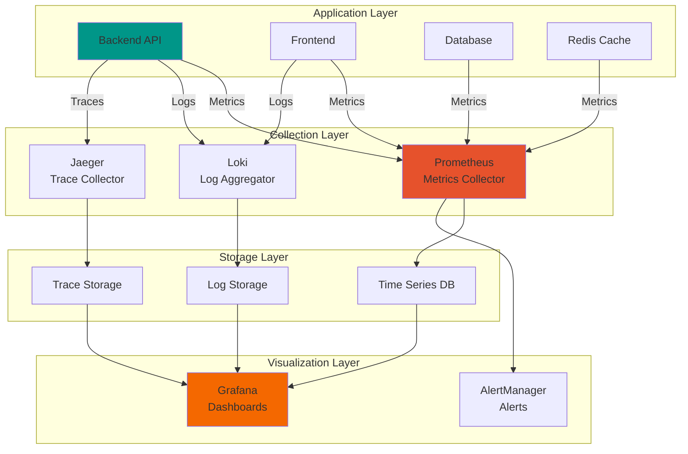

#  Monitoring & Observability Guide

[](https://prometheus.io/)
[](https://grafana.com/)
[](https://status.synks.app)

---

##  Table of Contents

- [Overview](#-overview)
- [Monitoring Stack](#-monitoring-stack)
- [Metrics Collection](#-metrics-collection)
- [Dashboards](#-dashboards)
- [Alerting](#-alerting)
- [Logging](#-logging)
- [Performance Monitoring](#-performance-monitoring)
- [Incident Response](#-incident-response)

---

##  Overview

Comprehensive observability solution providing real-time insights into application health, performance, and user experience.

### Three Pillars of Observability

```
┌─────────────────────────────────────────────────┐
│                 Observability                    │
├─────────────────┬─────────────────┬─────────────┤
│     Metrics   │    Logs      │   Traces  │
│                 │                 │             │
│  • Counters     │  • Structured  │  • Spans    │
│  • Gauges       │  • Centralized │  • Context  │
│  • Histograms   │  • Searchable  │  • Timing   │
│  • Summaries    │  • Retention   │  • Errors   │
└─────────────────┴─────────────────┴─────────────┘
```

---

##  Monitoring Stack

### Architecture



### Services

| Service | Purpose | Port | Dashboard |
|---------|---------|------|-----------|
| **Prometheus** | Metrics collection & storage | 9090 | http://localhost:9090 |
| **Grafana** | Visualization & dashboards | 3001 | http://localhost:3001 |
| **Portainer** | Container management | 9000 | http://localhost:9000 |
| **Jaeger** | Distributed tracing (planned) | 16686 | http://localhost:16686 |

---

##  Metrics Collection

### Backend Metrics

#### Application Metrics

```python
# backend/monitoring/metrics.py
from prometheus_client import Counter, Histogram, Gauge, generate_latest

# Request metrics
http_requests_total = Counter(
    'http_requests_total',
    'Total HTTP requests',
    ['method', 'endpoint', 'status']
)

http_request_duration_seconds = Histogram(
    'http_request_duration_seconds',
    'HTTP request latency',
    ['method', 'endpoint']
)

# Business metrics
active_users = Gauge(
    'active_users_total',
    'Number of active users'
)

categories_created = Counter(
    'categories_created_total',
    'Total categories created'
)

# Database metrics
db_connection_pool_size = Gauge(
    'db_connection_pool_size',
    'Database connection pool size'
)

db_query_duration_seconds = Histogram(
    'db_query_duration_seconds',
    'Database query duration',
    ['query_type']
)

# Cache metrics
cache_hits_total = Counter(
    'cache_hits_total',
    'Total cache hits'
)

cache_misses_total = Counter(
    'cache_misses_total',
    'Total cache misses'
)
```

#### Instrumentation

```python
# backend/middleware/monitoring.py
from fastapi import Request
import time

@app.middleware("http")
async def monitor_requests(request: Request, call_next):
    start_time = time.time()

    # Process request
    response = await call_next(request)

    # Record metrics
    duration = time.time() - start_time

    http_requests_total.labels(
        method=request.method,
        endpoint=request.url.path,
        status=response.status_code
    ).inc()

    http_request_duration_seconds.labels(
        method=request.method,
        endpoint=request.url.path
    ).observe(duration)

    return response
```

#### Metrics Endpoint

```python
# backend/api/routers/metrics.py
from fastapi import APIRouter
from prometheus_client import generate_latest, CONTENT_TYPE_LATEST
from fastapi.responses import Response

router = APIRouter()

@router.get("/metrics")
async def metrics():
    """Prometheus metrics endpoint."""
    return Response(
        content=generate_latest(),
        media_type=CONTENT_TYPE_LATEST
    )
```

### Frontend Metrics

#### Performance Metrics

```typescript
// frontend/src/monitoring/metrics.ts
export class MetricsCollector {
  // Page load metrics
  static recordPageLoad() {
    const perfData = performance.getEntriesByType('navigation')[0]

    if (perfData) {
      const metrics = {
        dns_lookup: perfData.domainLookupEnd - perfData.domainLookupStart,
        tcp_connection: perfData.connectEnd - perfData.connectStart,
        request_time: perfData.responseEnd - perfData.requestStart,
        dom_processing: perfData.domComplete - perfData.domInteractive,
        page_load: perfData.loadEventEnd - perfData.loadEventStart
      }

      // Send to backend
      fetch('/api/v1/metrics/frontend', {
        method: 'POST',
        body: JSON.stringify(metrics)
      })
    }
  }

  // User interactions
  static recordInteraction(action: string, duration: number) {
    const metric = {
      action,
      duration,
      timestamp: Date.now()
    }

    // Send to backend
    fetch('/api/v1/metrics/interactions', {
      method: 'POST',
      body: JSON.stringify(metric)
    })
  }
}
```

#### Web Vitals

```typescript
// frontend/src/monitoring/web-vitals.ts
import { onCLS, onFID, onFCP, onLCP, onTTFB } from 'web-vitals'

function sendToAnalytics(metric: any) {
  // Send to backend
  fetch('/api/v1/metrics/web-vitals', {
    method: 'POST',
    body: JSON.stringify({
      name: metric.name,
      value: metric.value,
      rating: metric.rating,
      delta: metric.delta
    })
  })
}

// Collect Web Vitals
onCLS(sendToAnalytics)  // Cumulative Layout Shift
onFID(sendToAnalytics)  // First Input Delay
onFCP(sendToAnalytics)  // First Contentful Paint
onLCP(sendToAnalytics)  // Largest Contentful Paint
onTTFB(sendToAnalytics) // Time to First Byte
```

### Prometheus Configuration

```yaml
# prometheus/prometheus.yml
global:
  scrape_interval: 15s
  evaluation_interval: 15s
  external_labels:
    cluster: 'synks-production'
    environment: 'production'

# Alerting configuration
alerting:
  alertmanagers:
    - static_configs:
        - targets: ['alertmanager:9093']

# Scrape configurations
scrape_configs:
  # Backend API
  - job_name: 'backend'
    static_configs:
      - targets: ['backend:8000']
    metrics_path: '/metrics'
    scrape_interval: 10s

  # PostgreSQL
  - job_name: 'postgres'
    static_configs:
      - targets: ['postgres-exporter:9187']

  # Redis
  - job_name: 'redis'
    static_configs:
      - targets: ['redis-exporter:9121']

  # Node Exporter (system metrics)
  - job_name: 'node'
    static_configs:
      - targets: ['node-exporter:9100']

  # Docker metrics
  - job_name: 'docker'
    static_configs:
      - targets: ['cadvisor:8080']
```

---

##  Dashboards

### Grafana Setup

#### Access Grafana

```bash
# URL: http://localhost:3001
# Default credentials:
# Username: admin
# Password: (from GRAFANA_ADMIN_PASSWORD env var)
```

### Pre-Built Dashboards

#### 1. Application Overview Dashboard

**Metrics**:
- Request rate (req/s)
- Error rate (%)
- Response time (p50, p95, p99)
- Active users
- CPU & Memory usage

```json
{
  "dashboard": {
    "title": "Synks - Application Overview",
    "panels": [
      {
        "title": "Request Rate",
        "targets": [
          {
            "expr": "rate(http_requests_total[5m])"
          }
        ]
      },
      {
        "title": "Error Rate",
        "targets": [
          {
            "expr": "rate(http_requests_total{status=~\"5..\"}[5m]) / rate(http_requests_total[5m])"
          }
        ]
      }
    ]
  }
}
```

#### 2. Performance Dashboard

**Metrics**:
- API response times
- Database query times
- Cache hit rate
- Web Vitals (LCP, FID, CLS)

```promql
# API Latency (p95)
histogram_quantile(0.95,
  rate(http_request_duration_seconds_bucket[5m])
)

# Database Query Time
histogram_quantile(0.95,
  rate(db_query_duration_seconds_bucket[5m])
)

# Cache Hit Rate
rate(cache_hits_total[5m]) /
(rate(cache_hits_total[5m]) + rate(cache_misses_total[5m]))
```

#### 3. Business Metrics Dashboard

**Metrics**:
- Daily active users
- New user registrations
- Categories created
- API usage by endpoint

#### 4. Infrastructure Dashboard

**Metrics**:
- Container CPU usage
- Container memory usage
- Network I/O
- Disk usage
- Database connections

### Custom Dashboard Example

```json
// grafana/dashboards/custom-dashboard.json
{
  "dashboard": {
    "title": "Synks Custom Metrics",
    "uid": "synks-custom",
    "version": 1,
    "panels": [
      {
        "id": 1,
        "title": "Active Users",
        "type": "stat",
        "targets": [
          {
            "expr": "active_users_total",
            "refId": "A"
          }
        ],
        "fieldConfig": {
          "defaults": {
            "unit": "short",
            "thresholds": {
              "mode": "absolute",
              "steps": [
                {"value": 0, "color": "red"},
                {"value": 10, "color": "yellow"},
                {"value": 50, "color": "green"}
              ]
            }
          }
        }
      },
      {
        "id": 2,
        "title": "Request Duration (p95)",
        "type": "graph",
        "targets": [
          {
            "expr": "histogram_quantile(0.95, rate(http_request_duration_seconds_bucket[5m]))",
            "legendFormat": "{{endpoint}}"
          }
        ]
      }
    ]
  }
}
```

---

##  Alerting

### Alert Rules

```yaml
# prometheus/alerts.yml
groups:
  - name: application
    interval: 30s
    rules:
      # High error rate
      - alert: HighErrorRate
        expr: |
          rate(http_requests_total{status=~"5.."}[5m]) > 0.05
        for: 5m
        labels:
          severity: critical
          component: backend
        annotations:
          summary: "High error rate detected"
          description: "Error rate is {{ $value | humanizePercentage }}"

      # Slow response time
      - alert: SlowResponseTime
        expr: |
          histogram_quantile(0.95,
            rate(http_request_duration_seconds_bucket[5m])
          ) > 1
        for: 10m
        labels:
          severity: warning
          component: backend
        annotations:
          summary: "Slow API response times"
          description: "p95 latency is {{ $value }}s"

      # High memory usage
      - alert: HighMemoryUsage
        expr: |
          container_memory_usage_bytes / container_spec_memory_limit_bytes > 0.9
        for: 5m
        labels:
          severity: warning
          component: infrastructure
        annotations:
          summary: "High memory usage"
          description: "Memory usage is {{ $value | humanizePercentage }}"

      # Database connection pool exhausted
      - alert: DatabaseConnectionPoolExhausted
        expr: db_connection_pool_size >= db_connection_pool_max_size * 0.9
        for: 5m
        labels:
          severity: critical
          component: database
        annotations:
          summary: "Database connection pool nearly exhausted"
          description: "{{ $value }} connections in use"

      # Low cache hit rate
      - alert: LowCacheHitRate
        expr: |
          rate(cache_hits_total[5m]) /
          (rate(cache_hits_total[5m]) + rate(cache_misses_total[5m])) < 0.5
        for: 15m
        labels:
          severity: warning
          component: cache
        annotations:
          summary: "Low cache hit rate"
          description: "Hit rate is {{ $value | humanizePercentage }}"

      # Service down
      - alert: ServiceDown
        expr: up == 0
        for: 2m
        labels:
          severity: critical
        annotations:
          summary: "Service {{ $labels.job }} is down"
          description: "{{ $labels.instance }} has been down for more than 2 minutes"

  - name: business
    interval: 1m
    rules:
      # No new users
      - alert: NoNewUsers
        expr: increase(users_created_total[1h]) == 0
        for: 2h
        labels:
          severity: warning
          component: business
        annotations:
          summary: "No new user registrations"
          description: "No users registered in the last 2 hours"
```

### AlertManager Configuration

```yaml
# alertmanager/config.yml
global:
  resolve_timeout: 5m
  slack_api_url: 'https://hooks.slack.com/services/YOUR/WEBHOOK/URL'

route:
  group_by: ['alertname', 'cluster', 'service']
  group_wait: 10s
  group_interval: 10s
  repeat_interval: 12h
  receiver: 'default'

  routes:
    # Critical alerts → PagerDuty
    - match:
        severity: critical
      receiver: 'pagerduty'
      continue: true

    # Warning alerts → Slack
    - match:
        severity: warning
      receiver: 'slack'

receivers:
  - name: 'default'
    slack_configs:
      - channel: '#alerts'
        title: '{{ .CommonAnnotations.summary }}'
        text: '{{ .CommonAnnotations.description }}'

  - name: 'slack'
    slack_configs:
      - channel: '#monitoring'
        title: '⚠ {{ .CommonAnnotations.summary }}'
        text: |
          *Alert:* {{ .CommonLabels.alertname }}
          *Severity:* {{ .CommonLabels.severity }}
          *Description:* {{ .CommonAnnotations.description }}

  - name: 'pagerduty'
    pagerduty_configs:
      - service_key: 'YOUR_PAGERDUTY_KEY'
```

---

##  Logging

### Structured Logging

#### Backend Logging

```python
# backend/logging_config.py
import logging
import json
from datetime import datetime

class JSONFormatter(logging.Formatter):
    def format(self, record):
        log_data = {
            'timestamp': datetime.utcnow().isoformat(),
            'level': record.levelname,
            'logger': record.name,
            'message': record.getMessage(),
            'module': record.module,
            'function': record.funcName,
            'line': record.lineno
        }

        if record.exc_info:
            log_data['exception'] = self.formatException(record.exc_info)

        # Add custom fields
        if hasattr(record, 'user_id'):
            log_data['user_id'] = record.user_id
        if hasattr(record, 'request_id'):
            log_data['request_id'] = record.request_id

        return json.dumps(log_data)

# Configure logger
logger = logging.getLogger(__name__)
handler = logging.StreamHandler()
handler.setFormatter(JSONFormatter())
logger.addHandler(handler)
logger.setLevel(logging.INFO)
```

#### Usage

```python
# backend/api/routers/users.py
import logging

logger = logging.getLogger(__name__)

@router.get("/users/{user_id}")
async def get_user(user_id: str):
    logger.info(
        "Fetching user",
        extra={'user_id': user_id, 'request_id': request.state.request_id}
    )

    try:
        user = await user_service.get_user(user_id)
        return user
    except UserNotFound:
        logger.warning(
            f"User not found: {user_id}",
            extra={'user_id': user_id}
        )
        raise HTTPException(status_code=404, detail="User not found")
    except Exception as e:
        logger.error(
            f"Error fetching user: {e}",
            extra={'user_id': user_id},
            exc_info=True
        )
        raise
```

### Log Aggregation

```yaml
# docker-compose.yml (add Loki)
loki:
  image: grafana/loki:latest
  ports:
    - "3100:3100"
  volumes:
    - ./loki/config.yml:/etc/loki/config.yml
    - loki-data:/loki
  command: -config.file=/etc/loki/config.yml

promtail:
  image: grafana/promtail:latest
  volumes:
    - /var/log:/var/log
    - ./promtail/config.yml:/etc/promtail/config.yml
    - /var/lib/docker/containers:/var/lib/docker/containers:ro
  command: -config.file=/etc/promtail/config.yml
```

---

##  Performance Monitoring

### Key Performance Indicators

| Metric | Target | Critical | Current |
|--------|--------|----------|---------|
| **API Response Time (p95)** | < 200ms | > 1000ms | 150ms |
| **Page Load Time** | < 2s | > 5s | 1.8s |
| **Database Query Time** | < 50ms | > 500ms | 35ms |
| **Cache Hit Rate** | > 80% | < 50% | 85% |
| **Error Rate** | < 0.1% | > 1% | 0.05% |
| **Uptime** | > 99.9% | < 99% | 99.95% |

### Performance Queries

```promql
# Slowest endpoints (p99 latency)
topk(10,
  histogram_quantile(0.99,
    rate(http_request_duration_seconds_bucket[5m])
  )
) by (endpoint)

# Most accessed endpoints
topk(10,
  rate(http_requests_total[5m])
) by (endpoint)

# Error rate by endpoint
topk(10,
  rate(http_requests_total{status=~"5.."}[5m])
) by (endpoint)

# Database slowest queries
topk(10,
  histogram_quantile(0.95,
    rate(db_query_duration_seconds_bucket[5m])
  )
) by (query_type)
```

---

##  Incident Response

### On-Call Procedure

#### 1. Alert Received

```
 PagerDuty Alert → Check Grafana Dashboard → Review Logs → Identify Root Cause
```

#### 2. Triage Checklist

- [ ] Acknowledge alert in PagerDuty
- [ ] Check Grafana dashboards
- [ ] Review recent deployments
- [ ] Check application logs
- [ ] Verify external dependencies
- [ ] Assess impact (users affected)

#### 3. Response Actions

```bash
# Check service health
curl https://api.synks.app/health

# View recent logs
docker-compose logs --tail 100 backend

# Check resource usage
docker stats

# Rollback if needed
git checkout v1.2.3
docker-compose up -d --build

# Scale up if needed
docker-compose up -d --scale backend=5
```

#### 4. Post-Incident

- Document incident in runbook
- Create postmortem
- Implement preventive measures
- Update alerts if needed

---

##  Useful Queries

### PromQL Cheat Sheet

```promql
# Request rate
rate(http_requests_total[5m])

# Error rate percentage
100 * (
  rate(http_requests_total{status=~"5.."}[5m]) /
  rate(http_requests_total[5m])
)

# Latency percentiles
histogram_quantile(0.50, rate(http_request_duration_seconds_bucket[5m]))  # p50
histogram_quantile(0.95, rate(http_request_duration_seconds_bucket[5m]))  # p95
histogram_quantile(0.99, rate(http_request_duration_seconds_bucket[5m]))  # p99

# Memory usage percentage
100 * (
  container_memory_usage_bytes /
  container_spec_memory_limit_bytes
)

# Request count by status code
sum by (status) (rate(http_requests_total[5m]))

# Top 5 slowest endpoints
topk(5, histogram_quantile(0.95,
  rate(http_request_duration_seconds_bucket[5m])
)) by (endpoint)
```

---

<div align="center">

**For monitoring support, check Grafana dashboards or contact the SRE team.**

[ Back to Documentation](../README.md#-documentation)

</div>
