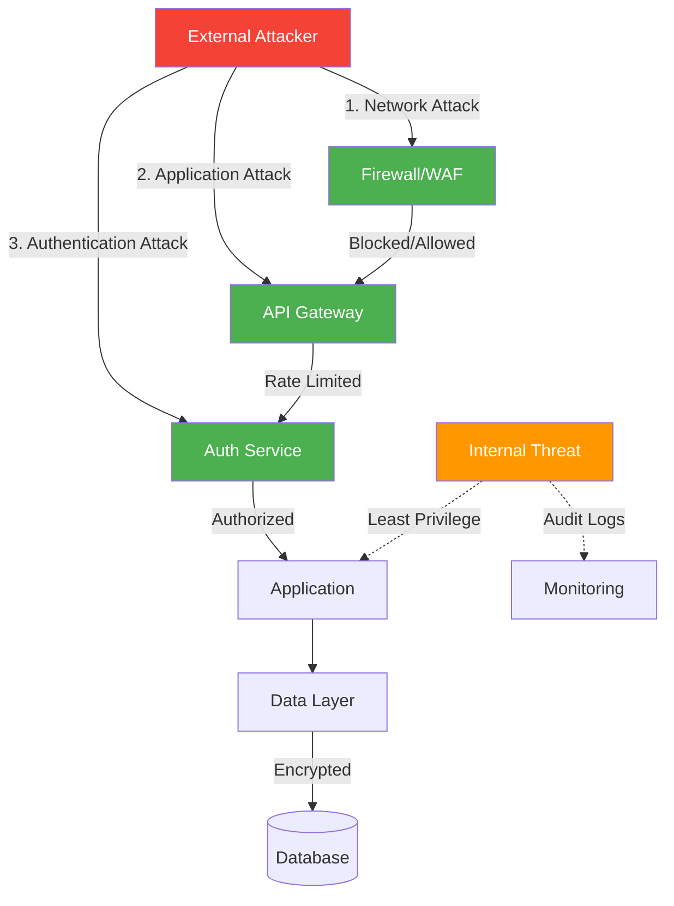
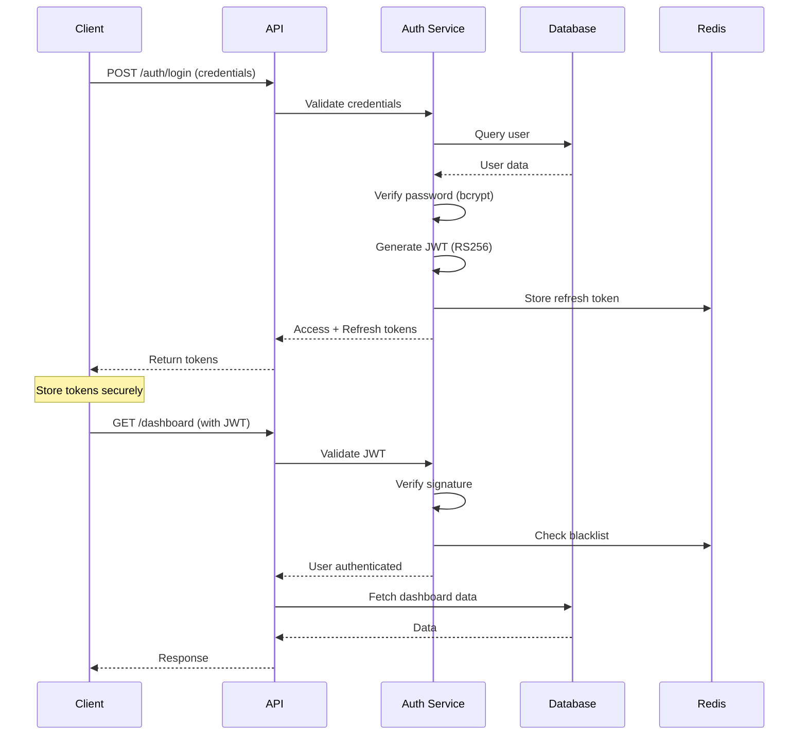

#  Security Guide

[](https://github.com/username/synks/security)
[](https://github.com/username/synks/security/code-scanning)
[](https://owasp.org/www-project-top-ten/)

---

##  Table of Contents

- [Overview](#-overview)
- [Security Architecture](#-security-architecture)
- [Authentication & Authorization](#-authentication--authorization)
- [Data Protection](#-data-protection)
- [API Security](#-api-security)
- [Infrastructure Security](#-infrastructure-security)
- [Security Testing](#-security-testing)
- [Incident Response](#-incident-response)
- [Compliance](#-compliance)

---

##  Overview

Comprehensive security implementation following industry best practices and OWASP Top 10 guidelines.

### Security Principles

| Principle | Implementation |
|-----------|----------------|
| **Defense in Depth** | Multiple layers of security controls |
| **Least Privilege** | Minimal necessary access rights |
| **Fail Secure** | Deny access on error conditions |
| **Security by Design** | Built-in from the start, not bolted on |
| **Zero Trust** | Never trust, always verify |

### Security Layers

```
┌─────────────────────────────────────────────┐
│          Edge Security (CDN/WAF)            │
├─────────────────────────────────────────────┤
│       Transport Security (TLS 1.3)          │
├─────────────────────────────────────────────┤
│     Network Security (Firewalls/SG)         │
├─────────────────────────────────────────────┤
│  Application Security (Auth/Input Validation)│
├─────────────────────────────────────────────┤
│      Data Security (Encryption at Rest)     │
├─────────────────────────────────────────────┤
│       Infrastructure Security (IAM)         │
└─────────────────────────────────────────────┘
```

---

##  Security Architecture

### Threat Model



### Attack Surface

| Component | Exposure | Mitigation |
|-----------|----------|------------|
| **API Endpoints** | Public | Rate limiting, authentication, input validation |
| **Database** | Private | Network isolation, encrypted connections, least privilege |
| **Redis Cache** | Private | Network isolation, authentication required |
| **Admin Interface** | Restricted | IP whitelist, MFA, audit logs |
| **CI/CD Pipeline** | Internal | Secret scanning, signed commits, RBAC |

---

##  Authentication & Authorization

### Authentication Flow



### JWT Implementation

#### Token Structure

```json
{
  "header": {
    "alg": "RS256",
    "typ": "JWT",
    "kid": "key-id-2024-01"
  },
  "payload": {
    "sub": "user-id-123",
    "email": "user@example.com",
    "roles": ["user", "admin"],
    "permissions": ["read:dashboard", "write:categories"],
    "iat": 1705334400,
    "exp": 1705338000,
    "iss": "https://api.synks.app",
    "aud": "https://synks.app",
    "jti": "unique-token-id"
  }
}
```

#### Backend Implementation

```python
# backend/security/jwt.py
from datetime import datetime, timedelta
from typing import Optional
import jwt
from cryptography.hazmat.primitives import serialization
from cryptography.hazmat.backends import default_backend

class JWTManager:
    def __init__(self, private_key_path: str, public_key_path: str):
        # Load RSA keys
        with open(private_key_path, 'rb') as f:
            self.private_key = serialization.load_pem_private_key(
                f.read(),
                password=None,
                backend=default_backend()
            )

        with open(public_key_path, 'rb') as f:
            self.public_key = serialization.load_pem_public_key(
                f.read(),
                backend=default_backend()
            )

    def create_access_token(
        self,
        user_id: str,
        email: str,
        roles: list[str],
        permissions: list[str]
    ) -> str:
        """Create JWT access token."""
        now = datetime.utcnow()
        payload = {
            'sub': user_id,
            'email': email,
            'roles': roles,
            'permissions': permissions,
            'iat': now,
            'exp': now + timedelta(hours=1),
            'iss': 'https://api.synks.app',
            'aud': 'https://synks.app',
            'jti': generate_jti()  # Unique token ID
        }

        return jwt.encode(
            payload,
            self.private_key,
            algorithm='RS256',
            headers={'kid': 'key-id-2024-01'}
        )

    def verify_token(self, token: str) -> dict:
        """Verify and decode JWT token."""
        try:
            payload = jwt.decode(
                token,
                self.public_key,
                algorithms=['RS256'],
                audience='https://synks.app',
                issuer='https://api.synks.app',
                options={
                    'verify_signature': True,
                    'verify_exp': True,
                    'verify_iat': True,
                    'verify_aud': True,
                    'verify_iss': True,
                    'require_exp': True,
                    'require_iat': True
                }
            )

            # Check token blacklist
            if await self.is_blacklisted(payload['jti']):
                raise JWTError('Token has been revoked')

            return payload

        except jwt.ExpiredSignatureError:
            raise JWTError('Token has expired')
        except jwt.InvalidTokenError as e:
            raise JWTError(f'Invalid token: {str(e)}')
```

### Password Security

```python
# backend/security/password.py
from passlib.context import CryptContext
import secrets
import string

pwd_context = CryptContext(
    schemes=["bcrypt"],
    deprecated="auto",
    bcrypt__rounds=12  # Cost factor
)

class PasswordManager:
    @staticmethod
    def hash_password(password: str) -> str:
        """Hash password using bcrypt."""
        # Validate password strength first
        if not PasswordManager.is_strong(password):
            raise ValueError("Password does not meet requirements")

        return pwd_context.hash(password)

    @staticmethod
    def verify_password(plain_password: str, hashed: str) -> bool:
        """Verify password against hash."""
        return pwd_context.verify(plain_password, hashed)

    @staticmethod
    def is_strong(password: str) -> bool:
        """Check password strength."""
        if len(password) < 12:
            return False

        has_upper = any(c.isupper() for c in password)
        has_lower = any(c.islower() for c in password)
        has_digit = any(c.isdigit() for c in password)
        has_special = any(c in string.punctuation for c in password)

        return all([has_upper, has_lower, has_digit, has_special])

    @staticmethod
    def generate_secure_password(length: int = 16) -> str:
        """Generate cryptographically secure password."""
        alphabet = string.ascii_letters + string.digits + string.punctuation
        return ''.join(secrets.choice(alphabet) for _ in range(length))
```

### Role-Based Access Control (RBAC)

```python
# backend/security/authorization.py
from enum import Enum
from typing import List

class Permission(Enum):
    # Dashboard
    READ_DASHBOARD = "read:dashboard"
    WRITE_DASHBOARD = "write:dashboard"

    # Categories
    READ_CATEGORIES = "read:categories"
    WRITE_CATEGORIES = "write:categories"
    DELETE_CATEGORIES = "delete:categories"

    # Users
    READ_USERS = "read:users"
    WRITE_USERS = "write:users"
    DELETE_USERS = "delete:users"

    # Admin
    ADMIN_ACCESS = "admin:*"

class Role(Enum):
    USER = "user"
    MANAGER = "manager"
    ADMIN = "admin"

# Permission mappings
ROLE_PERMISSIONS = {
    Role.USER: [
        Permission.READ_DASHBOARD,
        Permission.READ_CATEGORIES,
        Permission.WRITE_CATEGORIES
    ],
    Role.MANAGER: [
        Permission.READ_DASHBOARD,
        Permission.WRITE_DASHBOARD,
        Permission.READ_CATEGORIES,
        Permission.WRITE_CATEGORIES,
        Permission.DELETE_CATEGORIES,
        Permission.READ_USERS
    ],
    Role.ADMIN: [Permission.ADMIN_ACCESS]  # All permissions
}

def has_permission(user_roles: List[str], required_permission: Permission) -> bool:
    """Check if user has required permission."""
    for role_name in user_roles:
        role = Role(role_name)
        permissions = ROLE_PERMISSIONS.get(role, [])

        if Permission.ADMIN_ACCESS in permissions:
            return True

        if required_permission in permissions:
            return True

    return False


# Decorator for protecting endpoints
def require_permission(permission: Permission):
    def decorator(func):
        async def wrapper(*args, **kwargs):
            current_user = kwargs.get('current_user')

            if not has_permission(current_user.roles, permission):
                raise HTTPException(
                    status_code=403,
                    detail="Insufficient permissions"
                )

            return await func(*args, **kwargs)
        return wrapper
    return decorator


# Usage
@router.delete("/categories/{category_id}")
@require_permission(Permission.DELETE_CATEGORIES)
async def delete_category(
    category_id: str,
    current_user: User = Depends(get_current_user)
):
    # Delete logic
    pass
```

---

##  Data Protection

### Encryption at Rest

```python
# backend/security/encryption.py
from cryptography.fernet import Fernet
from cryptography.hazmat.primitives.kdf.pbkdf2 import PBKDF2HMAC
from cryptography.hazmat.primitives import hashes
import base64
import os

class DataEncryption:
    def __init__(self, master_key: str):
        self.cipher = Fernet(self._derive_key(master_key))

    @staticmethod
    def _derive_key(password: str, salt: bytes = None) -> bytes:
        """Derive encryption key from master password."""
        if salt is None:
            salt = os.urandom(16)

        kdf = PBKDF2HMAC(
            algorithm=hashes.SHA256(),
            length=32,
            salt=salt,
            iterations=100000,
        )

        key = base64.urlsafe_b64encode(kdf.derive(password.encode()))
        return key

    def encrypt(self, data: str) -> str:
        """Encrypt sensitive data."""
        return self.cipher.encrypt(data.encode()).decode()

    def decrypt(self, encrypted_data: str) -> str:
        """Decrypt sensitive data."""
        return self.cipher.decrypt(encrypted_data.encode()).decode()


# Database model with encrypted fields
from sqlalchemy import Column, String
from sqlalchemy.ext.hybrid import hybrid_property

class User(Base):
    __tablename__ = "users"

    id = Column(UUID, primary_key=True)
    email = Column(String, unique=True, nullable=False)
    _phone = Column("phone", String)  # Stored encrypted

    @hybrid_property
    def phone(self):
        """Decrypt phone number on access."""
        if self._phone:
            return encryption.decrypt(self._phone)
        return None

    @phone.setter
    def phone(self, value):
        """Encrypt phone number on set."""
        if value:
            self._phone = encryption.encrypt(value)
        else:
            self._phone = None
```

### Database Security

```python
# backend/database/security.py

# Connection string with SSL
DATABASE_URL = (
    "postgresql://{user}:{password}@{host}:{port}/{database}"
    "?sslmode=require"
    "&sslrootcert=/path/to/ca.pem"
    "&sslcert=/path/to/client-cert.pem"
    "&sslkey=/path/to/client-key.pem"
)

# Connection pool configuration
engine = create_async_engine(
    DATABASE_URL,
    pool_size=20,
    max_overflow=0,
    pool_pre_ping=True,
    pool_recycle=3600,
    connect_args={
        "server_settings": {
            "application_name": "synks_backend",
            "statement_timeout": "30000"  # 30 seconds
        }
    }
)
```

```sql
-- Database security configuration
-- Row Level Security (RLS)
ALTER TABLE users ENABLE ROW LEVEL SECURITY;

-- Policy: Users can only see their own data
CREATE POLICY user_isolation ON users
    FOR ALL
    TO authenticated_user
    USING (id = current_user_id());

-- Policy: Admins can see all data
CREATE POLICY admin_access ON users
    FOR ALL
    TO admin_user
    USING (true);

-- Audit logging
CREATE TABLE audit_logs (
    id UUID PRIMARY KEY DEFAULT gen_random_uuid(),
    user_id UUID,
    action VARCHAR(50) NOT NULL,
    table_name VARCHAR(50) NOT NULL,
    record_id UUID,
    old_values JSONB,
    new_values JSONB,
    ip_address INET,
    created_at TIMESTAMP DEFAULT NOW()
);

-- Audit trigger
CREATE OR REPLACE FUNCTION audit_trigger_func()
RETURNS TRIGGER AS $$
BEGIN
    INSERT INTO audit_logs (
        user_id, action, table_name, record_id,
        old_values, new_values, ip_address
    ) VALUES (
        current_user_id(),
        TG_OP,
        TG_TABLE_NAME,
        COALESCE(NEW.id, OLD.id),
        to_jsonb(OLD),
        to_jsonb(NEW),
        inet_client_addr()
    );
    RETURN NEW;
END;
$$ LANGUAGE plpgsql;

-- Apply audit trigger to sensitive tables
CREATE TRIGGER users_audit
    AFTER INSERT OR UPDATE OR DELETE ON users
    FOR EACH ROW EXECUTE FUNCTION audit_trigger_func();
```

---

##  API Security

### Input Validation

```python
# backend/security/validation.py
from pydantic import BaseModel, validator, EmailStr
import re

class UserCreateSchema(BaseModel):
    email: EmailStr
    password: str
    first_name: str
    last_name: str

    @validator('password')
    def validate_password(cls, v):
        if len(v) < 12:
            raise ValueError('Password must be at least 12 characters')

        if not re.search(r'[A-Z]', v):
            raise ValueError('Password must contain uppercase letter')

        if not re.search(r'[a-z]', v):
            raise ValueError('Password must contain lowercase letter')

        if not re.search(r'\d', v):
            raise ValueError('Password must contain digit')

        if not re.search(r'[!@#$%^&*(),.?":{}|<>]', v):
            raise ValueError('Password must contain special character')

        return v

    @validator('first_name', 'last_name')
    def validate_name(cls, v):
        if not re.match(r'^[a-zA-Z\s\-\']+$', v):
            raise ValueError('Name contains invalid characters')

        if len(v) > 50:
            raise ValueError('Name too long')

        return v.strip()

    class Config:
        # Prevent mass assignment
        extra = 'forbid'
```

### SQL Injection Prevention

```python
#  NEVER DO THIS (Vulnerable to SQL injection)
query = f"SELECT * FROM users WHERE email = '{email}'"
result = await db.execute(query)

#  Always use parameterized queries
from sqlalchemy import select, text

# ORM (preferred)
query = select(User).where(User.email == email)
result = await db.execute(query)

# Raw SQL with parameters
query = text("SELECT * FROM users WHERE email = :email")
result = await db.execute(query, {"email": email})
```

### XSS Prevention

```python
# backend/security/xss.py
import bleach
from markupsafe import escape

ALLOWED_TAGS = ['p', 'br', 'strong', 'em', 'u', 'a']
ALLOWED_ATTRS = {'a': ['href', 'title']}

def sanitize_html(dirty_html: str) -> str:
    """Sanitize HTML content."""
    return bleach.clean(
        dirty_html,
        tags=ALLOWED_TAGS,
        attributes=ALLOWED_ATTRS,
        strip=True
    )

def escape_user_input(user_input: str) -> str:
    """Escape user input for safe rendering."""
    return escape(user_input)


# Usage in API
@router.post("/categories")
async def create_category(data: CategoryCreate):
    # Sanitize HTML content
    data.description = sanitize_html(data.description)
    data.name = escape_user_input(data.name)

    category = await category_service.create(data)
    return category
```

### CSRF Protection

```python
# backend/security/csrf.py
from fastapi import Header, HTTPException
import secrets
import hmac
import hashlib

class CSRFProtection:
    def __init__(self, secret_key: str):
        self.secret_key = secret_key

    def generate_token(self, session_id: str) -> str:
        """Generate CSRF token."""
        timestamp = str(int(time.time()))
        token_value = f"{session_id}:{timestamp}"

        signature = hmac.new(
            self.secret_key.encode(),
            token_value.encode(),
            hashlib.sha256
        ).hexdigest()

        return f"{token_value}:{signature}"

    def verify_token(self, token: str, session_id: str) -> bool:
        """Verify CSRF token."""
        try:
            session, timestamp, signature = token.split(':')

            if session != session_id:
                return False

            # Token expires after 1 hour
            if int(time.time()) - int(timestamp) > 3600:
                return False

            expected_signature = hmac.new(
                self.secret_key.encode(),
                f"{session}:{timestamp}".encode(),
                hashlib.sha256
            ).hexdigest()

            return hmac.compare_digest(signature, expected_signature)

        except (ValueError, AttributeError):
            return False


# Middleware
@app.middleware("http")
async def csrf_middleware(request: Request, call_next):
    if request.method in ["POST", "PUT", "DELETE", "PATCH"]:
        csrf_token = request.headers.get("X-CSRF-Token")

        if not csrf_token or not csrf.verify_token(csrf_token, request.session_id):
            raise HTTPException(status_code=403, detail="CSRF validation failed")

    response = await call_next(request)
    return response
```

### Rate Limiting

```python
# backend/security/rate_limit.py
from fastapi import Request, HTTPException
from datetime import datetime, timedelta
import redis

class RateLimiter:
    def __init__(self, redis_client: redis.Redis):
        self.redis = redis_client

    async def check_rate_limit(
        self,
        key: str,
        max_requests: int,
        window_seconds: int
    ) -> bool:
        """Check if rate limit is exceeded."""
        current = await self.redis.get(key)

        if current is None:
            await self.redis.setex(key, window_seconds, 1)
            return True

        if int(current) >= max_requests:
            return False

        await self.redis.incr(key)
        return True


# Middleware
@app.middleware("http")
async def rate_limit_middleware(request: Request, call_next):
    # Rate limit by IP
    client_ip = request.client.host
    key = f"rate_limit:{client_ip}"

    if not await rate_limiter.check_rate_limit(key, max_requests=100, window_seconds=60):
        raise HTTPException(
            status_code=429,
            detail="Too many requests. Please try again later.",
            headers={"Retry-After": "60"}
        )

    response = await call_next(request)
    return response
```

### Security Headers

```python
# backend/middleware/security_headers.py
from fastapi import Request
from starlette.middleware.base import BaseHTTPMiddleware

class SecurityHeadersMiddleware(BaseHTTPMiddleware):
    async def dispatch(self, request: Request, call_next):
        response = await call_next(request)

        # Security headers
        response.headers["X-Content-Type-Options"] = "nosniff"
        response.headers["X-Frame-Options"] = "DENY"
        response.headers["X-XSS-Protection"] = "1; mode=block"
        response.headers["Strict-Transport-Security"] = "max-age=31536000; includeSubDomains"
        response.headers["Referrer-Policy"] = "strict-origin-when-cross-origin"
        response.headers["Permissions-Policy"] = "geolocation=(), microphone=(), camera=()"

        # Content Security Policy
        response.headers["Content-Security-Policy"] = (
            "default-src 'self'; "
            "script-src 'self' 'unsafe-inline' https://cdn.jsdelivr.net; "
            "style-src 'self' 'unsafe-inline'; "
            "img-src 'self' data: https:; "
            "font-src 'self' data:; "
            "connect-src 'self' https://api.synks.app; "
            "frame-ancestors 'none'; "
            "base-uri 'self'; "
            "form-action 'self'"
        )

        return response

# Register middleware
app.add_middleware(SecurityHeadersMiddleware)
```

---

##  Infrastructure Security

### Docker Security

```dockerfile
# Dockerfile best practices

# 1. Use specific versions (not 'latest')
FROM python:3.11.6-slim

# 2. Run as non-root user
RUN useradd -m -u 1000 appuser && \
    chown -R appuser:appuser /app
USER appuser

# 3. Read-only filesystem
# In docker-compose.yml:
# read_only: true
# tmpfs:
#   - /tmp

# 4. Drop unnecessary capabilities
# In docker-compose.yml:
# cap_drop:
#   - ALL
# cap_add:
#   - NET_BIND_SERVICE

# 5. Use security options
# In docker-compose.yml:
# security_opt:
#   - no-new-privileges:true
```

### Network Security

```yaml
# docker-compose.yml
networks:
  frontend:
    driver: bridge
  backend:
    driver: bridge
    internal: true  # No external access

services:
  frontend:
    networks:
      - frontend

  backend:
    networks:
      - frontend
      - backend

  postgres:
    networks:
      - backend  # Only accessible from backend
```

### Secrets Management

```bash
# Never commit secrets to Git
# Use environment variables or secret management tools

# AWS Secrets Manager
aws secretsmanager get-secret-value \
    --secret-id synks/database/password \
    --query SecretString --output text

# HashiCorp Vault
vault kv get secret/synks/database

# Kubernetes Secrets
kubectl create secret generic synks-secrets \
    --from-literal=db-password='secure_password'
```

---

##  Security Testing

### Automated Security Scanning

```yaml
# .github/workflows/security-scan.yml
- name: Run Trivy vulnerability scanner
  uses: aquasecurity/trivy-action@master
  with:
    scan-type: 'fs'
    scan-ref: '.'
    severity: 'CRITICAL,HIGH'
    exit-code: '1'

- name: Run Bandit (Python security linter)
  run: bandit -r backend/ -ll

- name: Run npm audit
  run: cd frontend && npm audit --audit-level=high
```

### Manual Security Testing

```bash
# OWASP ZAP scanning
docker run -t owasp/zap2docker-stable zap-baseline.py \
    -t https://staging.synks.app

# SQL injection testing
sqlmap -u "https://api.synks.app/users?id=1" --batch

# SSL/TLS testing
testssl.sh https://synks.app
```

---

##  Incident Response

### Security Incident Playbook

**1. Detection → 2. Containment → 3. Eradication → 4. Recovery → 5. Lessons Learned**

#### Incident Response Team

- **Incident Commander**: Coordinates response
- **Technical Lead**: Investigates and remediates
- **Communications Lead**: Updates stakeholders
- **Legal/Compliance**: Assesses regulatory requirements

#### Response Procedures

See [Incident Response Runbook](./INCIDENT_RESPONSE.md) for detailed procedures.

---

## 📜 Compliance

### Standards & Regulations

- **GDPR**: General Data Protection Regulation
- **CCPA**: California Consumer Privacy Act
- **SOC 2**: Service Organization Control 2
- **PCI DSS**: Payment Card Industry Data Security Standard (if applicable)

### Data Protection

- Right to access
- Right to erasure
- Right to data portability
- Privacy by design

---

<div align="center">

**For security concerns, please email security@synks.app or report via GitHub Security Advisories.**

[ Back to Documentation](../README.md#-documentation)

</div>
